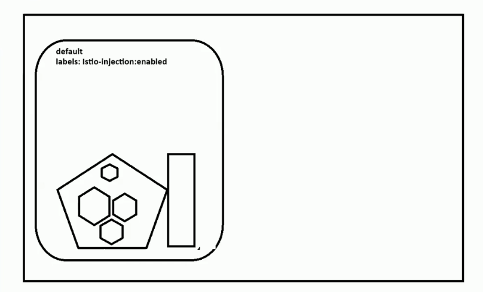
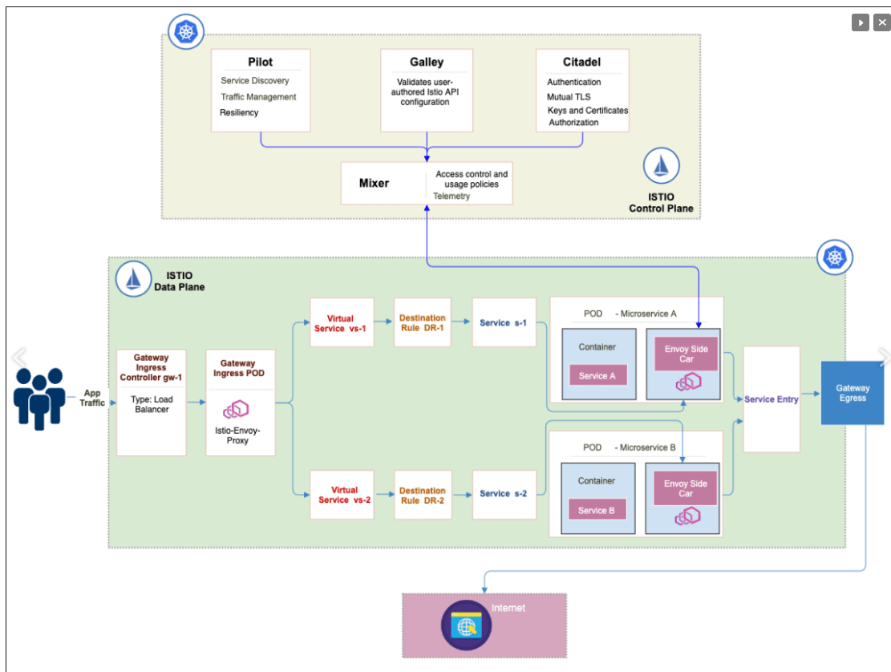

* Pod will contain one or more containers
> kubectl logs nginx-pod -c httpd
> kubect delete pod 
* Bydefault There is hidden container in each pod. default container is called PAUSE container but it is hidden. The resposibility of PAUSE container is to enable network for other containers in the POD.

### Network communication:
* Container to container in same POD
* POD to POD communication with in same NODE
* POD to POD communication where PODS are spread across different Nodes

### kubernetes CNI Plugins
[CNI plugins](https://kubernetes.io/docs/concepts/extend-kubernetes/compute-storage-net/network-plugins/)

* **Calico** network plug in. by default, K8s will support basic networking. when 3rd party network plug in installed, it will support advanced networking

* **Cilium** -- another plugin
* **flannel** -- another plugin

* **CNI**: Container network interface
In Azure Kubernetes Service (AKS), the **Container Networking Interface (CNI)** is responsible for the networking of the containers within the Kubernetes cluster. AKS supports multiple CNI plugins, and you can choose the most suitable one depending on your needs.


### 3. **Summary of Key Differences**:

| Feature                      | Kubernetes Native Networking | Calico (CNI Plugin)                               |
|------------------------------|------------------------------|--------------------------------------------------|
| **Pod-to-Pod Communication**  | Yes, basic                   | Yes, with advanced routing and BGP support       |
| **Network Policy**            | Basic                        | Advanced policies, including egress and DNS-based |
| **Overlay/Non-Overlay Support**| No (requires CNI plugin)     | Supports both overlay (VXLAN/IPIP) and non-overlay (BGP) |
| **BGP Support**               | No                           | Yes, enables efficient routing without encapsulation |
| **IP Address Management (IPAM)**| Basic                       | Advanced IPAM with efficient allocation strategies |
| **Traffic Encryption**        | No                           | Yes, encryption between pods                     |
| **Cloud Integration**         | Basic                        | Deep integration with AWS, Azure, GCP            |
| **QoS and Traffic Shaping**   | No                           | Yes, advanced control                            |
| **IPv6 Support**              | No                           | Yes                                              |
| **Logging and Monitoring**    | Basic                        | Detailed network flow logs and troubleshooting tools |

#### **What Calico Provides Beyond Kubernetes Networking**:
   
   - **IP Address Management (IPAM)**: While Kubernetes assigns IP addresses to pods, Calico enhances this by providing more advanced IP address management, including dynamic allocation of IPs, CIDR block management, and efficient IP utilization.
   
   - **Network Policies**: Kubernetes has basic **NetworkPolicy** support, but Calico significantly extends this functionality. It offers more granular and flexible policy controls, including:
     - **Global Network Policies**: Policies that can span multiple namespaces or even clusters.
     - **Layer 3 and 4 Policy Controls**: Calico can enforce policies at Layer 3 (IP level) and Layer 4 (TCP/UDP port level), providing more fine-grained control over pod-to-pod communication.
     - **Egress Policies**: You can control not only inbound traffic but also outbound traffic from pods, which Kubernetes NetworkPolicy doesn't natively support very well.

   - **Overlay and Non-Overlay Networking**: 
     - **Overlay Networking**: Calico can implement a fully routed network (BGP-based) or use VXLAN/IPIP overlays if needed, which is useful in environments where direct routing between nodes isn’t possible.
     - **Non-Overlay Networking**: Calico uses a BGP (Border Gateway Protocol) routing mesh, which allows it to avoid overlays in most cases, providing better performance. BGP enables direct routing between pods on different nodes without encapsulation (as opposed to solutions like Flannel, which rely on overlay networks).

   - **BGP Peering**: Calico supports BGP, which allows nodes to exchange routing information and build a highly scalable, efficient, and low-latency network. This is particularly useful in large-scale, multi-node deployments or hybrid cloud environments.

   - **High Performance**: Since Calico can avoid the overhead of encapsulation (used by many overlay networks like Flannel), it generally provides better networking performance. Direct routing, using BGP, reduces latency and increases throughput.

   - **Native Integration with Cloud Providers**: Calico integrates with cloud-native networking models, like AWS, GCP, and Azure, allowing for seamless integration between Kubernetes clusters and cloud networking services (such as VPCs, security groups, and firewalls).

   - **Network Encryption**: Calico supports network traffic encryption between pods, improving security for workloads that require it.

   - **Service-based Access Control**: Calico allows policies to be applied based on services and provides DNS-based network policies, which can enforce rules based on DNS names rather than IPs, useful in dynamic environments.
   
   - **Integration with Security Tools**: Calico integrates well with other security tools and platforms (e.g., Istio, Envoy), and it can enforce network security policies on both Kubernetes pods and host workloads (non-containerized services).
   
   - **Support for IPv6**: In addition to IPv4, Calico supports IPv6 networks, allowing dual-stack configurations (both IPv4 and IPv6).

   - **Advanced Traffic Shaping & QoS**: Calico can help shape traffic, manage Quality of Service (QoS), and provide bandwidth control for specific network paths.

   - **Logging and Troubleshooting**: Calico provides detailed logging and network flow data, which helps with network visibility, monitoring, and troubleshooting. This is important in complex, multi-tenant Kubernetes environments.


While Kubernetes provides the basic framework for networking, CNI plugins like **Calico** add advanced networking capabilities, including improved performance, more flexible network policies, and better security controls. If you're looking for basic networking, Kubernetes' native model might be sufficient. However, for production environments requiring fine-tuned control over networking, Calico provides significant additional features like BGP routing, advanced network policies, and cloud-native integration.

### Types of CNIs Used in AKS

1. **Azure CNI (Advanced Networking)**
   - **Azure CNI** provides integration between AKS and the Azure Virtual Network (VNet). Each pod gets an IP address from the Azure VNet subnet, allowing pods to communicate directly with other resources within the VNet, like VMs, databases, and other services.
   - **Key features:**
     - Every pod gets a routable IP address from the Azure VNet.
     - It supports network security group (NSG) rules.
     - Better suited for complex networking needs where tight integration with Azure VNet is required.
     - Suitable for production workloads needing advanced networking and secure, isolated environments.
   - **Use case:** Enterprises that need complete integration with existing VNets and want their pods to have their own Azure VNet IP addresses.

2. **Kubenet (Basic Networking)**
   - **Kubenet** is the default, basic networking plugin in AKS, where each node gets an IP address from the VNet, but pods receive a separate IP address from a private IP range allocated by Kubernetes itself.
   - **Key features:**
     - Pods use Network Address Translation (NAT) to communicate with other pods or external services.
     - Pods can communicate with each other using VNet routing, but the IPs are not directly part of the VNet.
     - Easier to manage in smaller clusters with fewer networking needs.
   - **Use case:** Small-scale deployments or environments where simplicity is preferred over deep VNet integration.

3. **Azure CNI Overlay (Preview)**
   - **Azure CNI Overlay** is a new networking option that allows more IP addresses to be available for large clusters, overcoming IP exhaustion challenges seen in large clusters with many nodes.
   - **Key features:**
     - Pods get their IP addresses from an overlay network instead of directly from the VNet IP address pool.
     - Enables the creation of larger clusters without consuming as many IP addresses from the Azure VNet.
     - Still integrates with Azure VNet for VM communication, but pods use the overlay network.
   - **Use case:** Suitable for large-scale Kubernetes clusters where IP exhaustion is a concern and Azure VNet integration is still required.

### Examples of CNI Choices for AKS
- **Azure CNI**:
  ```bash
  az aks create --resource-group myResourceGroup --name myAKSCluster \
    --network-plugin azure --vnet-subnet-id /subscriptions/<sub>/resourceGroups/myResourceGroup/providers/Microsoft.Network/virtualNetworks/myVnet/subnets/mySubnet
  ```
- **Kubenet** (default):
  ```bash
  az aks create --resource-group myResourceGroup --name myAKSCluster
  ```
- **Azure CNI Overlay (Preview)**:
  ```bash
  az aks create --resource-group myResourceGroup --name myAKSCluster \
    --network-plugin azure --network-policy azure --enable-cni-overlay
  ```

### Choosing the Right CNI:
- **Azure CNI**: Best for production environments needing full VNet integration and control over pod networking.
- **Kubenet**: Good for small clusters or dev/test environments where simplicity is key.
- **Azure CNI Overlay**: Useful for large-scale clusters to manage IP address availability efficiently.

Each of these CNIs fits different use cases based on scalability, network complexity, and integration requirements.

kubectl get pods -A

kubectl api-resources
---

### Services
 in kubernetes world, Services is the networking object which helps to expose outside world.

 * Service is the abstraction from deploymen to access from outside.
 * Service will be mapped to specific deployment

 * Types of Services
   - ClusterIP
   - NodePort
   - LoadBalancer
       - NodePort doesn’t have such sophisticated traffic management.
       - You have to manually manage security features like IP restrictions, rate limiting, or SSL termination, which requires more operational effort and increases the potential for misconfiguration.
       - Potential for Overload
       - Static Ports are Limited
       - Lack of Fine-Grained Access Control: NodePort services do not inherently provide mechanisms for fine-grained access control, such as authorization, authentication, or IP whitelisting
### Load Balancer

* Layer7 and Layer4
* Path based routing and host based routing
* Layer7 can handle to route multiple applications using path based or host based routing
* But Network load balancer can not handle multiple applications

* Layer 4 LB --> Layer 7 LB (Ingress) --> Deployments (based on routing rules)

### Ingress

* Ingress controller will be managed by Controller manager
* Monitoring current state
* Identify differences if any
* 

> Desired State -> Actual state
* Analyze -> observer -> ACT

> kubectl delete -f .
> kubectl get ingress


## Master Node Components

* 1. API Server
     - Entry point to the cluster
     - Authentication and authrization would happend through API Server
     - Passport is authentication and visa is authorization
     - 
* 2. ETCD
* 3. Control panel
      - Self healing capacity handle by Control panel
      - Fetch the details from schedular
* 4. Schedular
     - Monitor the Worker node capacity and how many nodes are running...
* 5. Cloud component (Managed cluster)

* Kubelet
    - Provide statics about nodes, It will send heart beats, resource utilization, remaining capaciy to schedular
* KubeProxy:
   - Identify nearest pod 


> kubectl config use-context
> kubectl config get-context

---
### Namespaces
  -- Resource control
  -- Access Control
  -- Communication control
  -- Logically partition and organize resources

### ResourceQuota
### Limitrange

* m -> Milli core
* Mi -> MibiBytes

* 1Mi = 1000 ki
1 Gi  = 1000 Mi


> kubectl top pods -n dev-team
> kubectl exec -it todo-app-7565665 -- /bin/bash
> kubectl exec -it todo-app-7565665 -- /bin/sh


Q) delete Namespace
q) Multi tenant
q) Network policies at namepsace level
---
### RBAC:

* **Role** : Namespace level access -> Authorization
* **RoleBinding**

* **ClusterRole**: Namespace level access
* **ClusterRoleBinding**

* There is no user management in Kubernetes
* K8s will use respective cloud managed users 
* IAM:Identification and Authorization management

### Netpol

* There are native net policies in Kubernetes

* advanced 3rparty policy tools
kyverno
cilium
Myverno
---
## **Volumes**:
* EmptyDir
* HostPath
* Persistent Volumes

### Persistent Volumes
   * Static Volumes
   * Dynamic Volumes
* File based storage vs Diskbased storage
* Disk storage won't allow sharing
* Pd: Persistent disk storage are by default supports rwo (read write once) only

* filestore and PD names for Google cloud, these names may change in other cloud vendors
* in static provisioning, no need to mention about storage class in manifest file as we are manually creating the storage in respective cloud
* Dynamic or static provision is based on how the external storage is created
* By default fileshares are sharable
* Common File system (when we share the file...in windows)
---
### **Disk Storage vs. File Storage in Cloud Environments**

#### 1. **Disk Storage** (Block Storage):
Disk storage, also known as block storage, is like virtual hard drives attached to virtual machines (VMs). Each disk (block) is treated as an independent unit and is typically associated with a specific VM or compute instance. This is similar to how physical disks are attached to physical servers.

- **Key Features:**
  - **Attached to a single VM**: A disk can be attached to only one VM (usually) at a time.
  - **High IOPS**: Suitable for applications requiring high input/output operations per second (IOPS), such as databases.
  - **Raw Block Access**: Provides direct raw block access, allowing the OS and applications to handle the filesystem.
  - **Use Cases**: Databases (e.g., SQL, NoSQL), transaction-heavy applications, and virtual machine operating system disks.

- **Examples**:
  - **Azure**: Managed Disks (Premium SSD, Standard HDD)
  - **AWS**: Elastic Block Storage (EBS)
  - **Google Cloud**: Persistent Disk (PD)

- **Access Modes**:
  - **RWO (ReadWriteOnce)**: Block storage disks typically provide **RWO** access, which means the disk can be mounted to a single instance in read-write mode.
  - The reason for this is that **block storage doesn’t natively support shared access**. Unlike file systems, block storage operates at a lower abstraction layer where concurrent writes from multiple sources would cause conflicts without a shared file system overlay to handle it.

#### 2. **File Storage**:
File storage is like a shared network drive. It uses a file system to organize data in directories and files, making it accessible to multiple clients at the same time. It allows multiple instances to access the same files concurrently, with proper locking mechanisms to avoid data corruption.

- **Key Features**:
  - **Network File Share**: Can be mounted across multiple VMs/instances at the same time.
  - **Lower IOPS than Disk Storage**: Typically provides lower performance in terms of IOPS compared to block storage.
  - **File-Level Access**: Files are managed via standard file system protocols like NFS or SMB.
  - **Use Cases**: File sharing, content management systems, data lakes, backup storage, home directories.

- **Examples**:
  - **Azure**: Azure Files (NFS, SMB support)
  - **AWS**: Amazon Elastic File System (EFS)
  - **Google Cloud**: Filestore

- **Access Modes**:
  - **RWX (ReadWriteMany)**: File storage typically allows **RWX** (ReadWriteMany) access, meaning multiple instances can read and write to the same file system concurrently. This makes it ideal for shared workloads.

---

### **Why Disk Storage is Limited to RWO (ReadWriteOnce)**
The primary reason disk storage is usually limited to **RWO** (ReadWriteOnce) in most cloud providers is due to how block storage is designed at the infrastructure level:

1. **Consistency and Data Integrity**:
   - **Block storage operates at a low level (block-level operations)**, and multiple systems writing to the same block device without coordination can cause data corruption. File systems typically manage concurrent access, but block storage doesn't have this layer of management.
   - To avoid data corruption and ensure consistency, cloud providers restrict block storage to a single write access point at a time. Only one VM can mount the disk in read-write mode (RWO).

2. **Performance Optimization**:
   - Block storage is optimized for **high throughput** and **low latency** for a single client (VM). Allowing multiple instances to write concurrently would degrade performance.
   - Shared read-write access at the block level would require sophisticated locking and coordination mechanisms, which would reduce the speed and efficiency of block storage.

3. **Shared File Systems** (e.g., NFS/SMB):
   - For applications that need shared access across multiple instances, **file storage solutions (e.g., NFS, SMB)** are recommended. File systems are specifically designed to handle concurrency, locking, and data consistency when multiple clients are accessing the same files.

---

### **Summary of Differences**:

| Feature                    | **Disk Storage (Block Storage)**            | **File Storage (Network File Share)**          |
|----------------------------|---------------------------------------------|-----------------------------------------------|
| **Access Mode**             | RWO (ReadWriteOnce)                         | RWX (ReadWriteMany)                           |
| **Concurrency**             | Can be attached to a single VM at a time    | Can be mounted by multiple VMs simultaneously |
| **Performance (IOPS)**      | Higher IOPS, optimized for single VM        | Lower IOPS, suitable for multiple concurrent accesses |
| **Use Cases**               | Databases, virtual machine OS disks         | File sharing, content management, backups     |
| **Example Cloud Services**  | Azure Managed Disks, AWS EBS, Google PD     | Azure Files, AWS EFS, Google Filestore        |
| **Access Layer**            | Block-level access                          | File-level access                             |
| **Protocols**               | None (direct block access)                  | SMB, NFS                                      |
| **Consistency**             | Direct block access (manual file system)    | File system consistency, handles locking      |

### Conclusion:
- **Disk Storage** is ideal for high-performance workloads that require low-latency block-level access, but it is limited to **RWO** to maintain data consistency.
- **File Storage** is preferred for workloads that require concurrent access from multiple instances, offering **RWX** access.

---
## Why Use Static Persistent Volumes in Kubernetes?
**Compliance Requirements**: In scenarios where storage must be pre-allocated or approved by a separate team (e.g., financial, healthcare, or government regulations).

**Integration with Legacy Systems**: When integrating Kubernetes with legacy, on-premises, or third-party storage systems that don't support dynamic provisioning.

**Tight Control Over Storage Resources**: When manual control over the storage lifecycle and permissions is necessary.

Static provisioning isn't just an optional feature; it's a crucial method for integrating Kubernetes with specific, controlled environments that demand tighter storage management and compliance.

### Stateful SETs

* Each pod will use proper naming
* Head less service
* Sequential order of pods creation.
* Deletion also follow reverse order of deletion.
* Each pod would have dedicated storage

* Good use case is to use Stateful sets is for Database 

>kubectl api-resources

* while configuring headless service, configuration entry is with cluserIP is none
```
clusterIP: None
```

* statefull sets are dns based
* each service will have FQDN
*  eg: mysql.svc.default.cluster.local

* Stetefulsets are not created replicasets behind.

> kubectl getsts

* Self healing capability is different for stateful sets
* Administrative overhead is more for statefulsets
What if pod got restarted?

Here are some **Kubernetes StatefulSet interview questions and answers** for an **architect-level** role:

### 1. **What is a StatefulSet in Kubernetes? How does it differ from a Deployment?**
   **Answer**:
   A **StatefulSet** is a Kubernetes workload API object used to manage **stateful applications**. It provides guarantees about the ordering and uniqueness of Pods. Unlike Deployments, which are ideal for stateless applications, StatefulSets are used for applications that require **stable network identities** and **persistent storage**.

   **Differences from Deployments**:
   - **Stable Pod identity**: Each Pod in a StatefulSet has a unique, persistent identifier (e.g., `myapp-0`, `myapp-1`).
   - **Ordered, graceful deployment and scaling**: Pods are created and deleted in a defined order.
   - **Stable storage**: Each Pod can be associated with its own **PersistentVolume** (PV) which is retained even when the Pod is deleted.
   - **Use Cases**: Databases (e.g., Cassandra, MySQL), distributed systems (e.g., Kafka, Zookeeper), and any other application that requires persistence and ordered scaling.

---

### 2. **How does StatefulSet ensure Pod uniqueness and persistence?**
   **Answer**:
   StatefulSet ensures Pod uniqueness by assigning each Pod a **unique identity** using an ordinal index (e.g., `pod-0`, `pod-1`, `pod-2`). These identities are retained even when Pods are rescheduled or restarted.

   StatefulSets also maintain **persistent storage** by binding each Pod to a specific **PersistentVolume (PV)**. The PV is retained even if the Pod is deleted or moved to a different node. The storage is not automatically deleted, ensuring data persistence across Pod restarts.

---

### 3. **Explain how StatefulSet handles Pod scaling and upgrades.**
   **Answer**:
   StatefulSet ensures **ordered scaling** and upgrades:
   - **Scaling Up**: New Pods are created **sequentially**. For example, if you scale from 3 to 5 replicas, `pod-3` is created first, followed by `pod-4`. Each new Pod is only created after the previous one becomes healthy and ready.
   - **Scaling Down**: Pods are **terminated in reverse order** (starting from the highest ordinal). For example, `pod-4` is terminated first, followed by `pod-3`.
   - **Rolling Updates**: Updates to StatefulSet Pods (like container image updates) are also done in an ordered manner. Pods are updated one at a time, ensuring minimal disruption.

---

### 4. **What happens when a StatefulSet Pod fails? How is it replaced?**
   **Answer**:
   When a **StatefulSet Pod fails**, Kubernetes will recreate the Pod, maintaining the **same identity and storage**. The Pod will be recreated with the same name and retain its PersistentVolume, ensuring data persistence.

   However, unlike Deployments where Pods are treated as interchangeable, StatefulSet Pods have **individual identities**, so the recovery process focuses on restoring the specific failed Pod with its associated data and state.

---

### 5. **What is the role of Headless Services in StatefulSets?**
   **Answer**:
   In Kubernetes, a **Headless Service** is used with StatefulSets to provide **stable network identities** to Pods. Instead of load balancing, the Headless Service allows each Pod in the StatefulSet to have its own **DNS entry**.

   For example, if the Headless Service is named `myapp` and the StatefulSet has 3 replicas, the Pods will have DNS names like:
   - `myapp-0.myapp.default.svc.cluster.local`
   - `myapp-1.myapp.default.svc.cluster.local`
   - `myapp-2.myapp.default.svc.cluster.local`

   This is important for stateful applications that need to maintain consistent identities across restarts.

---

### 6. **Describe a real-world use case for StatefulSet in Kubernetes.**
   **Answer**:
   A typical use case for StatefulSet is managing **distributed databases** like Cassandra, MongoDB, or MySQL clusters. These databases require:
   - **Persistent storage**: Each database node stores data that must persist across restarts.
   - **Stable network identities**: Each database node in the cluster must have a unique, stable identity for inter-node communication.
   - **Ordered deployment**: Database clusters often require that nodes are brought online in a specific order (e.g., primary first, followed by replicas).

   StatefulSet provides the required functionality, allowing each node in the database cluster to maintain its identity, data, and role within the cluster.

---

### 7. **How does StatefulSet handle Pod recreation on node failure?**
   **Answer**:
   When a node fails and the StatefulSet Pods on that node become unavailable, Kubernetes will try to reschedule the affected Pods onto other healthy nodes. The rescheduled Pods will retain their **same identities (DNS names)** and **PersistentVolumes**.

   Since the Pods in a StatefulSet are stateful, Kubernetes ensures that the new Pod instance attaches to the same PersistentVolume (PV), allowing it to recover its data and state from where it left off.

---

### 8. **What are the limitations of StatefulSets?**
   **Answer**:
   - **Manual Scaling and Recovery**: StatefulSets do not offer the same auto-scaling capabilities as stateless Deployments. Manual intervention might be needed to handle scaling efficiently.
   - **Performance Concerns**: StatefulSets can be slower to scale up/down because Pods are created and terminated in a specific order.
   - **No Native Backup Mechanism**: While PersistentVolumes ensure data persistence, StatefulSets do not provide built-in backup or snapshot functionality for data. External solutions are required for backup and recovery.
   - **Only RWO (ReadWriteOnce) Access for Persistent Volumes**: PersistentVolumes used in StatefulSets typically support **RWO (ReadWriteOnce)** access, meaning they can only be mounted by a single Pod at a time.

---

### 9. **Can StatefulSet Pods be scaled automatically?**
   **Answer**:
   While StatefulSets don’t have built-in auto-scaling capabilities like **Deployments** or **ReplicaSets**, you can use **Custom Metrics** and **Horizontal Pod Autoscalers (HPA)** to achieve auto-scaling. However, since StatefulSets manage Pods in a specific order and with individual identities, auto-scaling must be done carefully to avoid disrupting the order or state of the application.

   **Example**: For a database cluster running on StatefulSet, you might want to scale based on custom resource metrics like CPU or memory usage, but you’ll need to ensure that the newly added nodes integrate correctly with the existing nodes.

---

### 10. **How do you manage stateful workloads that require high availability in Kubernetes using StatefulSets?**
   **Answer**:
   To manage stateful workloads with high availability:
   1. **Pod Disruption Budgets (PDB)**: Use PDBs to ensure that a minimum number of Pods remain available during voluntary disruptions (like upgrades).
   2. **Anti-Affinity Rules**: Use **Pod anti-affinity** to distribute StatefulSet Pods across different nodes, availability zones, or failure domains, reducing the risk of data loss or downtime if a node or zone fails.
   3. **PersistentVolume Backups**: Implement regular **backups** for PersistentVolumes to ensure data is recoverable in case of storage failures.
   4. **Multi-AZ Deployments**: For cloud environments, deploy StatefulSets across multiple availability zones to ensure resiliency in case of zone failures.

This ensures that even if one part of the infrastructure fails, the stateful workloads remain available and consistent.

---

### Final Thoughts:
For an architect-level role, **StatefulSets** are critical in handling stateful applications in Kubernetes. Knowing how to effectively deploy and manage them is essential for building scalable, resilient, and highly available distributed systems.
---
* Replicaset
* Deployment (stateless set)
* Statefulsets -- databases, radiscache, filesystem
* Daemonsets
---
### DaemonSets:

* Daemonsets, we don't need to declare replicaset

* kubectl get daemonsets

Use cases:
 - Monitoring (Promatious, graphans)
 - Security
 - Agents
 - Backup agent

## JOBs

## CRON JOBS

---
### Affinity Rules
* Node Affinity
* POD Affinity

> Affinity means mapping

preferredDuringSchedulingIgnoredDuringExecution
requiredDuringSchedulingIgnoredDuringExecution

#### Nodeaffinity
```
affinity:
  nodeAffinity:
    requiredDuringSchedulingIgnoredDuringExecution:
      nodeSelectorTerms:
      - matchExpression:
        - key: env
          operator: In
          values:
            - prod
  
```

> kunectl label node <node_name> env=prod
> kubectl get pods -o wide

#### Podaffinity
```
affinity:
  PodAffinity:
    requiredDuringSchedulingIgnoredDuringExecution:
      - labelSelector:
          matchExpression:
          -  key: app
             operator: In
             values:
               - nginx
          topologykey: location
           
  
```

---
### PDB (POD Disruption Budget)
 * Eviction process

 * Istio is nothing but service mesh

 ### Package Manager
 ### Life Without Package Management Tools

Before package management tools like **NPM**, **Helm**, or **Chocolatey** existed, developers faced several challenges when installing, managing, and updating software dependencies. Here's what the development experience was like without them:

#### **Challenges Without Package Managers:**

1. **Manual Dependency Management**
   - Developers had to manually find, download, and install libraries, frameworks, and tools. This often involved tracking down individual websites, ensuring you got the right version, and managing installation paths.
   - If dependencies had sub-dependencies, these also had to be manually located and installed, making it easy to miss critical libraries.

2. **Version Conflicts**
   - Without a package manager to help handle dependencies and versions, it was easy to end up with **version conflicts**. Different projects might require different versions of the same library, and managing these conflicts was often done manually.

3. **Installation Complexity**
   - Developers had to follow long, error-prone installation procedures. This included manually setting environment variables, paths, and configurations.
   - Installing a new system on a fresh machine could take hours or days, as software had to be installed one by one, with each installation potentially impacting others.

4. **No Centralized Updates**
   - Updating software meant manually checking for new versions and applying them. This process could break compatibility with existing software, and rollback was not easy.
   - Critical security updates were often missed due to lack of awareness or because manual updates were tedious.

5. **Inconsistent Environments**
   - Setting up development environments was time-consuming and prone to human error. A developer working on a team could easily have a slightly different environment than their colleagues, leading to **"works on my machine"** problems.
   - CI/CD pipelines and testing environments had to be manually aligned, often resulting in inconsistencies between development, testing, and production environments.

### Life With Package Management Tools

With the advent of tools like **NPM**, **Helm**, and **Chocolatey**, developers' lives have been transformed. These tools automate much of the complexity involved in dependency management, installation, and updates, leading to more efficient development processes.

#### **Benefits With Package Managers:**

1. **Automatic Dependency Resolution**
   - Package managers automatically resolve and install **dependencies**. For example, **NPM** for JavaScript automatically installs all libraries a project depends on with a single command (`npm install`).
   - **Helm** does this for Kubernetes applications, bundling all required Kubernetes resources into charts and resolving dependencies between microservices, making application deployment seamless.
   
2. **Version Management**
   - Package managers handle **versioning** of packages, allowing developers to specify exact or compatible versions. This ensures that dependencies don't unexpectedly break when a new version is released.
   - Tools like NPM provide **semver** (semantic versioning) which ensures the right versions of dependencies are installed, avoiding conflicts and ensuring stability.

3. **Centralized Repositories**
   - Most package managers rely on central repositories where developers can search for, download, and update software packages. This eliminates the need to scour the internet for libraries.
   - Chocolatey provides a large repository of Windows applications, while NPM has thousands of JavaScript libraries readily available.

4. **Simplified Installation**
   - Installation of packages or software is as simple as running a single command. For example, with Chocolatey, installing Google Chrome can be done using `choco install googlechrome`, which reduces installation times.
   - These tools often handle environment configuration, making it easier for developers to set up their systems and ensure they’re running the correct versions of their dependencies.

5. **Consistency Across Environments**
   - Package managers ensure **environment consistency**. Development, testing, and production environments can all use the same versions of libraries and packages, minimizing bugs related to environmental differences.
   - **NPM lock files** (`package-lock.json`) ensure that the exact same versions of dependencies are used across different environments, preventing inconsistencies.

6. **Security and Update Management**
   - Package managers can easily check for **security vulnerabilities** and notify developers if any packages have known issues. For instance, **NPM** warns about security vulnerabilities during package installation.
   - **Automated updates** allow for quickly applying bug fixes, new features, and security patches across all environments, reducing the risk of outdated and insecure software.

7. **Reusability and Shareability**
   - Package managers make it easy to **share reusable code** through package repositories. For example, developers can publish JavaScript libraries to **NPM** or Docker images to a registry, allowing others to easily install and use them.
   - Teams can build and share Helm charts across projects, reducing redundancy and improving collaboration.

#### **Example of Developer Life With and Without Package Managers:**

- **Without NPM:**
   - You want to use **React** for a project. You’d have to manually download React, its dependencies (like ReactDOM), and any other third-party libraries (such as Webpack, Babel) from different sources. You’d also need to figure out how to bundle and manage them in your project.
   
- **With NPM:**
   - You simply run `npm install react react-dom` to install React and its dependencies. If you want Webpack or Babel, you run another simple command, and NPM will handle the rest.

- **Without Helm:**
   - Deploying a complex microservices application to Kubernetes would require you to manually write and maintain dozens of YAML files, deploy them in the correct order, and ensure everything is correctly wired together.
   
- **With Helm:**
   - You define all your services, deployments, and configurations in a single Helm chart, and with one command (`helm install`), the entire stack is deployed and managed efficiently.

### Conclusion: Developer Life Before and After Package Managers
Without package management tools, developers spent a significant amount of time manually installing, configuring, and maintaining dependencies, which slowed down development and introduced errors. With the advent of package managers like **NPM**, **Helm**, and **Chocolatey**, the software development process has become faster, more reliable, and more secure. Package managers automate tasks, reduce complexity, and ensure consistency across environments, freeing developers to focus on writing code rather than managing dependencies.
### HELM
* Helm is a package manager
* Windows package managers
        - Choco
        - Winget  > Microsoft tool
        - chocolatee
* Linux package manager
         - Yum
         - Apt

* Helm should be installed where the kubernetes services are managed is where helm will be installed.
  - Example: if your cluser is connected from windows laptop

* Helm components
  - Charts:
     https://artifacthub.io
     - templates
     - values.yaml
* **Helm Commands:**
  * Helm lint .\voting-app\
  * Helm package
  * helm create
  * helm status
  * helm report

Here are some of the most commonly used Helm commands:

### 1. **helm repo add**  
   Adds a Helm chart repository.
   ```bash
   helm repo add <repo-name> <repo-url>
   ```

### 2. **helm repo update**  
   Updates your Helm chart repositories.
   ```bash
   helm repo update
   ```

### 3. **helm search repo**  
   Searches for Helm charts in repositories.
   ```bash
   helm search repo <chart-name>
   ```

### 4. **helm install**  
   Installs a Helm chart.
   ```bash
   helm install <release-name> <chart-name>
   ```

### 5. **helm upgrade**  
   Upgrades an existing Helm release.
   ```bash
   helm upgrade <release-name> <chart-name>
   ```

### 6. **helm uninstall**  
   Uninstalls a Helm release.
   ```bash
   helm uninstall <release-name>
   ```

### 7. **helm status**  
   Shows the status of a Helm release.
   ```bash
   helm status <release-name>
   ```

### 8. **helm list**  
   Lists all Helm releases.
   ```bash
   helm list
   ```

### 9. **helm rollback**  
   Rolls back a release to a previous revision.
   ```bash
   helm rollback <release-name> <revision-number>
   ```

### 10. **helm show values**  
   Shows the default values of a Helm chart.
   ```bash
   helm show values <chart-name>
   ```

### 11. **helm package**  
   Packages a Helm chart into a `.tgz` archive.
   ```bash
   helm package <chart-directory>
   ```

### 12. **helm template**  
   Renders the chart templates locally and displays the output without deploying.
   ```bash
   helm template <release-name> <chart-name>
   ```

### 13. **helm dependency update**  
   Updates dependencies for a chart in the local `Chart.yaml` file.
   ```bash
   helm dependency update <chart-directory>
   ```

These commands cover most use cases when working with Helm for managing Kubernetes applications.
   
  kubectl port-forward svc/prometh

 ---
 Monotoring tools:
  * **DataDog**
  * **prometheus & Grafana**
  * **dynatrace**

  ---
  ### Prometheus and Grafana

  Prometheus is time series database.
  Prometheus collects data from system
  Every monitoring tools will have agents to collect data
  Exporter will be installed 
  Time Series Database (TSDB)-- It Screapes all the metrics endpoints
  Prometheus would maintain historic data

  #### **Prometheus Components**
  * Prometheus Server
  * 192.168.1.100/metrics
  * Volumes - Storage
  * Alert Manger

  Grafana -- Visualization tools

  operatorhub.io
  argocd

  Kubectl port-forward svc/prom-stack-kube-prometheus
  promql is the query language to pull the data from prometheus server
  Metric Types:  
    * Counters
    * Gauges : Cpu utilization, memory utilization
    * Historgrams: How much time it took to fetch info(Latency)
    * Summaries

    * kubectl get secret -n monitoring
    extract secret from kubernetes secrets

---
Prometheus is a powerful open-source monitoring system widely used in **Kubernetes environments** to collect, store, and query metrics data. Its architecture is designed for reliability and scalability, particularly for dynamic environments like Kubernetes.

### How Prometheus Works on Kubernetes to Collect Data:

In a Kubernetes environment, Prometheus is deployed as a **Kubernetes Pod** and uses the **pull-based model** to scrape metrics from various endpoints. Here’s how it operates:

1. **Metric Endpoints Exposure**: Kubernetes applications (or the kubelet, services, etc.) expose metrics in the **Prometheus exposition format** on HTTP endpoints (typically at `/metrics`).
  
2. **Service Discovery**: Prometheus uses **Kubernetes service discovery** to automatically find the endpoints it needs to scrape metrics from. It looks for Pods, Services, or Endpoints annotated with `prometheus.io/scrape=true` and automatically discovers these targets.

3. **Data Scraping**: Prometheus regularly scrapes (pulls) metrics from these discovered endpoints at configurable intervals (usually 15-30 seconds). Each scrape collects real-time data about the application’s performance, resource usage, and health.

4. **Time Series Database**: Collected metrics are stored in Prometheus's built-in **time series database (TSDB)**, where each metric is indexed by labels like `instance`, `job`, and custom labels from Kubernetes (e.g., `pod`, `namespace`, etc.).

5. **Alerting and Rules**: Prometheus allows users to define **alerting rules** based on metrics. For example, you can set up alerts to notify you when CPU usage is too high or when a service is down. These alerts are sent to an **Alertmanager** component, which can route notifications via email, Slack, PagerDuty, etc.

6. **Visualization**: Collected metrics can be visualized through **Prometheus’s native UI**, or more commonly through **Grafana**, which integrates seamlessly with Prometheus to display real-time dashboards.

---

### Prometheus Architecture

Prometheus’s architecture is modular and designed for efficiency and reliability. Here's an overview of the main components:

#### 1. **Prometheus Server**
   - **Core Component**: This is the central part of the Prometheus ecosystem that scrapes metrics and stores them in its time series database.
   - **Pull-Based Model**: Prometheus pulls data from **exporters** or instrumented services at regular intervals.
   - **Service Discovery**: In Kubernetes, Prometheus uses native service discovery mechanisms (APIs) to dynamically find metrics from various Kubernetes objects (Pods, Nodes, Endpoints, etc.).
   - **Storage**: Prometheus stores the collected data locally in a highly efficient **time series database (TSDB)** using label-based indexing.

#### 2. **Data Collection (Exporters)**
   - Prometheus collects data from two sources:
     - **Exporters**: Exporters are specialized programs that expose metrics in Prometheus’s format. Common exporters in Kubernetes include:
       - **Node Exporter**: Collects hardware and OS-level metrics.
       - **Kube-State-Metrics**: Collects metrics about the state of Kubernetes objects like Deployments, Nodes, Pods, etc.
       - **cAdvisor (Container Advisor)**: Collects container performance metrics.
     - **Instrumented Applications**: Applications instrumented with a Prometheus client library expose internal metrics directly on a `/metrics` endpoint.

#### 3. **Alertmanager**
   - The **Alertmanager** handles alerts generated by Prometheus when metric thresholds are breached.
   - **Routing**: Alerts are routed based on rules (e.g., sending to email, Slack, or PagerDuty).
   - **Grouping**: Alerts can be grouped to reduce noise and alert fatigue.

#### 4. **Pushgateway (Optional)**
   - The **Pushgateway** allows short-lived batch jobs or ephemeral services (like cron jobs) to push metrics to Prometheus. Since Prometheus is primarily pull-based, the Pushgateway provides a way to handle metrics for jobs that do not exist long enough to be scraped.

#### 5. **PromQL (Prometheus Query Language)**
   - PromQL is the query language used by Prometheus to extract and aggregate time series data.
   - You can query metrics to analyze performance trends or trigger alerts using PromQL.

---

### Prometheus Architecture Diagram:

Here’s a breakdown of the architecture components in a diagrammatic form:

```
+------------------+                         +-----------------------+
|                  |                         |                       |
|  Instrumented    |                         |      Prometheus        |
|  Applications    |                         |       Server           |
| (Pods, Services) | <--Pulls Metrics--       | +---------------------|
|  + Exporters     |                         | |  Time Series DB      |
| (Node, KubeState)|                         | +---------------------+
|                  |                         |                       |
+------------------+                         | +---------------------|
                                              | |  Service Discovery  |
+------------------+                         | +---------------------+
|                  |                         |                       |
| Pushgateway (Optional)                      | +---------------------|
| (For Short Jobs) | --> Pushes Metrics -->   | |       PromQL        |
|                  |                         | +---------------------+
+------------------+                         |                       |
                                              +-----------------------+

+-----------------+                             +----------------------+
|                 |        Sends Alerts         |                      |
|  Alertmanager   | <------------------------   |      Grafana          |
| (Routes, Groups)|                             |  (Visualization)      |
+-----------------+                             +----------------------+
```

---

### How Prometheus Works with Kubernetes:
1. **Service Discovery**: Prometheus automatically discovers **Kubernetes objects** (Pods, Services, Nodes) through the Kubernetes API. It uses the `prometheus.io/scrape` annotations and labels to know which endpoints to scrape.
   
2. **Scraping Metrics**: Prometheus scrapes metrics from **Kube-State-Metrics**, **cAdvisor**, and various instrumented applications running in the cluster.

3. **Storage**: Metrics are stored in the Prometheus server’s **time series database**. Prometheus typically runs within the cluster itself.

4. **Alerting**: Based on the collected metrics, Prometheus evaluates its **alert rules** to trigger alerts. These alerts are sent to the **Alertmanager**, which handles routing and deduplication.

5. **Visualization**: Metrics stored in Prometheus can be queried via **Prometheus’s UI** or through **Grafana**, which is a popular choice for visualizing Prometheus metrics.

### Key Components in Kubernetes:

- **Kube-State-Metrics**: Provides metrics about Kubernetes objects such as Pods, Nodes, Deployments, etc. These metrics focus on the state of the objects (e.g., pod status).
- **cAdvisor**: Provides resource usage and performance metrics of containers running in Kubernetes (e.g., CPU, memory).
- **Node Exporter**: Provides hardware and OS-level metrics (e.g., disk usage, memory).
  
### Summary of Prometheus in Kubernetes:

- **Service Discovery**: Automatically discovers endpoints using Kubernetes annotations.
- **Pull-Based Scraping**: Periodically scrapes metrics from exposed endpoints.
- **Time Series Storage**: Stores scraped data in an efficient time-series database.
- **Alerting**: Integrates with Alertmanager to handle and route alerts.
- **Visualization**: Works seamlessly with Grafana for powerful metric visualization and dashboarding.

Prometheus is widely adopted in Kubernetes due to its flexibility, scalability, and powerful metric collection and monitoring capabilities.
---

> kubectl port-forward svc/prom-stack-kube-prometheus-prometheus 90909:9090 -n monitoring

### ISTIO (Service Mesh)
      -- alternate technology is Linkerd
   ISTIO is sidecar based deployment
* ISTIO Components
 - Control Plane
    - Pilot  -> routing rule manager
    - Mixer  -> control policies Management, monitoring data collection
    - Citadel -> Security and identity managment
    - Galley -> Configuration data
    - Kiali  -> 
 - Data Plane

* artifacthub.io

Below lable will be defied for given namespace, Label "istio-injection=enabled"
* kubectl label ns default istio-injection=enabled

* istio will provide optimized route, it is same as kubeproxy in cluster
* Istio will help to encrypt the communicate between services, by default kuster is not provided the encryption.
* Istio envy proxy added as sidecar container in each pod, envy prox is automatically added by add the the lable "istio-injection=enabled" to the deployment/service


[istio](https://istio.io/latest/docs/ops/deployment/architecture/)

* istio can be installed multiple ways
  - helm charts
  - istioctl

  * kiali component provide dashboards.
  * Istio helps for deployment strategies
    - Canary
    - Blug-Green
    - Rolling updates.
* **Istio components**
* Control Plane
## Deployment strategies
Canary 
Blug Green
Rolling Updates

---
keypass
---
### ACR (Azure Container registry)

- Scanning tools
* Azure defender
* Amazon inspector

Here are some advanced **.NET LINQ (Language Integrated Query)** interview questions tailored for a **Technical Lead** role. These questions test not only LINQ usage but also the ability to optimize, debug, and design complex systems involving LINQ.

---
Here are advanced **.NET interview questions and answers** focused on **Asynchronous Programming** and **Parallel Programming**, tailored for a **Technical Lead** position:

### **Asynchronous Programming in .NET**

---

### **1. What is the difference between synchronous and asynchronous programming?**
   - **Expected Answer**:
     - **Synchronous programming** executes tasks one after the other, blocking the thread until a task completes before moving to the next.
     - **Asynchronous programming** allows the thread to continue processing other tasks while waiting for a long-running task to complete. It improves application responsiveness and resource utilization by avoiding thread blocking.
     - In **.NET**, asynchronous programming is typically achieved using `async` and `await` keywords to avoid blocking the calling thread while waiting for the completion of I/O-bound or CPU-bound tasks.

---

### **2. What are `async` and `await` in .NET? How do they work?**
   - **Expected Answer**:
     - The **`async`** keyword is used to mark a method as asynchronous, meaning it can contain `await` expressions. It does not make a method run on a separate thread but allows the calling thread to continue executing while waiting for an asynchronous operation.
     - The **`await`** keyword is used inside an `async` method to pause the method execution until the awaited task completes. After the task completes, the method resumes execution.
     - Example:
     ```csharp
     public async Task<string> GetDataAsync() {
         HttpClient client = new HttpClient();
         string data = await client.GetStringAsync("https://example.com");
         return data;
     }
     ```
     - **`async`** enables writing non-blocking code by freeing up threads while waiting for I/O or other operations.

---

### **3. What is `Task` in .NET, and how is it different from `Thread`?**
   - **Expected Answer**:
     - **`Task`** in .NET is an abstraction for managing asynchronous work. It represents an operation that will complete in the future and is used in conjunction with the `async` and `await` keywords.
     - **`Thread`** represents a separate flow of execution. It is lower-level and manually managed.
     - **Differences**:
       - A `Task` provides higher-level abstraction and better control over asynchronous programming, including built-in exception handling, continuations, and cancellation.
       - Tasks leverage **Thread Pool**, reducing overhead compared to manually managing threads.
       - **Tasks** are more scalable for I/O-bound tasks, whereas **Threads** are often used for CPU-bound work.

---

### **4. What are `Task.Run` and `Task.FromResult`?**
   - **Expected Answer**:
     - **`Task.Run`** is used to run CPU-bound operations on a separate thread, offloading work to the **Thread Pool**.
     - Example:
     ```csharp
     Task<int> result = Task.Run(() => {
         // Perform CPU-bound task
         return SomeCPUIntensiveWork();
     });
     ```
     - **`Task.FromResult`** is used to create a completed `Task` with a result. This is useful when you have synchronous data that you want to return as a `Task` in an asynchronous method.
     - Example:
     ```csharp
     public Task<int> GetResultAsync() {
         return Task.FromResult(42); // Returning an already completed task
     }
     ```

---

### **5. What is the difference between `Task.WhenAll` and `Task.WhenAny`?**
   - **Expected Answer**:
     - **`Task.WhenAll`** waits for all tasks in the collection to complete before proceeding. It returns a `Task` that completes when all the provided tasks have completed.
     - **`Task.WhenAny`** returns a `Task` that completes when any of the tasks in the collection completes, allowing for the fastest task to continue the execution.
     - Example:
     ```csharp
     Task<int> t1 = Task.Run(() => ComputeValue1());
     Task<int> t2 = Task.Run(() => ComputeValue2());
     
     var allTasks = Task.WhenAll(t1, t2); // Waits for both
     var firstTask = Task.WhenAny(t1, t2); // Waits for any one
     ```

---

### **6. What is `ConfigureAwait(false)`, and why is it used?**
   - **Expected Answer**:
     - **`ConfigureAwait(false)`** is used to tell the `await` keyword not to capture the current **SynchronizationContext** (usually the UI thread) and to continue execution on any available thread, improving performance in non-UI applications.
     - By default, `await` captures the context to resume execution on the original thread, which can introduce unnecessary context-switching overhead. Using `ConfigureAwait(false)` avoids this for background operations where the continuation does not need to run on the original thread.
     - Example:
     ```csharp
     await SomeAsyncMethod().ConfigureAwait(false); // Does not need the UI thread
     ```

---

### **7. How would you handle exceptions in asynchronous code?**
   - **Expected Answer**:
     - In asynchronous code, exceptions are captured and stored inside the `Task`. They are propagated when the `Task` is awaited.
     - To handle exceptions, surround the `await` call with a `try-catch` block.
     - Example:
     ```csharp
     try {
         await SomeAsyncMethod();
     } catch (Exception ex) {
         Console.WriteLine($"Exception: {ex.Message}");
     }
     ```
     - For **parallel tasks**, exception handling can be done using `Task.WhenAll`, which aggregates exceptions from all tasks into an **AggregateException**.
     - Example:
     ```csharp
     try {
         await Task.WhenAll(task1, task2);
     } catch (AggregateException ex) {
         foreach (var innerEx in ex.InnerExceptions) {
             Console.WriteLine(innerEx.Message);
         }
     }
     ```

---
Here are additional **.NET interview questions and answers** on **asynchronous** and **parallel programming**, exploring advanced scenarios to strengthen your preparation for a **Technical Lead** position.

### **Asynchronous Programming: Advanced Concepts**

---

### **1. What is `IAsyncEnumerable<T>` in C#?**
   - **Expected Answer**:
     - **`IAsyncEnumerable<T>`** is used to enable asynchronous iteration over a collection of elements. It allows the use of `await` with the `foreach` loop, providing a more efficient way to work with streams of data where results become available over time.
     - **Example**:
     ```csharp
     public async IAsyncEnumerable<int> GetNumbersAsync() {
         for (int i = 0; i < 10; i++) {
             await Task.Delay(100);  // Simulating asynchronous work
             yield return i;
         }
     }

     await foreach (var number in GetNumbersAsync()) {
         Console.WriteLine(number);
     }
     ```
     - This is useful for scenarios like processing large datasets or streaming data where the entire collection isn't available upfront.

---

### **2. How does `ValueTask<T>` differ from `Task<T>`?**
   - **Expected Answer**:
     - **`ValueTask<T>`** is a structure that provides a more efficient way to represent asynchronous operations that may be completed synchronously.
     - Unlike **`Task<T>`**, which always allocates an object, **`ValueTask<T>`** can avoid unnecessary heap allocations when the result is already available or cached, improving performance in performance-critical paths.
     - However, **`ValueTask<T>`** has limitations:
       - It can only be awaited once.
       - It’s more complex to work with since improper use can lead to unexpected behavior.
     - Example:
     ```csharp
     public ValueTask<int> GetCachedValueAsync() {
         if (cacheAvailable)
             return new ValueTask<int>(cachedValue); // Synchronous completion
         return new ValueTask<int>(GetValueFromDatabaseAsync()); // Asynchronous completion
     }
     ```

---

### **3. How does `async void` differ from `async Task` and `async Task<T>`?**
   - **Expected Answer**:
     - **`async void`** is used for fire-and-forget methods, often in event handlers, and does not return a `Task`. It cannot be awaited, which makes error handling difficult since exceptions thrown in `async void` methods propagate directly to the calling thread.
     - **`async Task`** should be used for asynchronous methods that return no result but need to be awaited for completion.
     - **`async Task<T>`** is used for asynchronous methods that return a result.
     - **Example**:
     ```csharp
     async void OnButtonClick(object sender, EventArgs e) {
         await Task.Delay(1000);  // `async void` for event handlers
     }
     
     public async Task PerformWorkAsync() {
         await Task.Delay(1000);  // `async Task`
     }
     
     public async Task<int> CalculateAsync() {
         await Task.Delay(1000);
         return 42;  // `async Task<T>`
     }
     ```

---

### **4. How do you handle long-running tasks in asynchronous programming?**
   - **Expected Answer**:
     - For CPU-bound long-running tasks, it’s a good practice to offload them to the **Thread Pool** using `Task.Run` or configure the task to run on a dedicated thread using `TaskCreationOptions.LongRunning`.
     - Example:
     ```csharp
     Task longRunningTask = Task.Factory.StartNew(() => {
         PerformLongRunningWork();
     }, TaskCreationOptions.LongRunning);
     ```
     - For I/O-bound long-running tasks, rely on `async`/`await` without manually spawning threads. The `async` infrastructure will handle it efficiently.

---

### **5. What is `SynchronizationContext`, and how does it affect asynchronous programming?**
   - **Expected Answer**:
     - **`SynchronizationContext`** is used to capture the context in which the asynchronous method is executed and ensures that the continuation after an `await` resumes on the captured context (e.g., UI thread in a desktop application).
     - In UI applications (e.g., WPF, WinForms), the `SynchronizationContext` ensures the code after an `await` continues on the UI thread. In other environments (e.g., ASP.NET Core), there’s no synchronization context, so continuations can run on any available thread.
     - Use `ConfigureAwait(false)` to avoid capturing the `SynchronizationContext`, which improves performance in background operations where there is no need to return to the original thread.
     - Example:
     ```csharp
     await DoWorkAsync().ConfigureAwait(false);
     ```

---

### **Parallel Programming: Advanced Concepts**

---

### **1. How do you handle parallel tasks that need to share data?**
   - **Expected Answer**:
     - When multiple parallel tasks need to access or modify shared data, you must handle synchronization carefully to avoid race conditions. Options include:
       - **Locks (e.g., `lock` or `Monitor`)**: Used to ensure that only one task accesses a critical section at a time.
       - **Concurrent collections (e.g., `ConcurrentDictionary`, `BlockingCollection`)**: Provide thread-safe operations without the need for explicit locks.
       - **Interlocked class**: Provides atomic operations for simple data types like integers.
     - Example:
     ```csharp
     object lockObject = new object();
     int sharedResource = 0;
     
     Parallel.For(0, 100, i => {
         lock (lockObject) {
             sharedResource++;  // Safely update shared data
         }
     });
     ```

---

### **2. What are the performance trade-offs between `Parallel.ForEach` and `Task.WhenAll`?**
   - **Expected Answer**:
     - **`Parallel.ForEach`** is ideal for CPU-bound tasks where the workload can be divided into small chunks and executed in parallel. It leverages the **Thread Pool** to schedule work across multiple threads.
     - **`Task.WhenAll`** is more flexible, allowing you to work with tasks explicitly and is often used for I/O-bound operations. It provides better control over task execution and supports asynchronous operations.
     - **Trade-offs**:
       - `Parallel.ForEach` can have overhead due to thread management, especially if tasks are not CPU-bound.
       - `Task.WhenAll` is more scalable for I/O-bound tasks since it doesn’t rely on creating additional threads.
     - Example:
     ```csharp
     // Parallel.ForEach for CPU-bound work:
     Parallel.ForEach(dataList, item => ProcessItem(item));

     // Task.WhenAll for I/O-bound work:
     var tasks = dataList.Select(item => ProcessItemAsync(item));
     await Task.WhenAll(tasks);
     ```

---

### **3. What are the implications of using `TaskCreationOptions.LongRunning`?**
   - **Expected Answer**:
     - **`TaskCreationOptions.LongRunning`** hints to the **Task Scheduler** that the task will be long-running and should not use a thread from the **Thread Pool**. Instead, it creates a dedicated thread for that task.
     - This is useful for tasks that could block **Thread Pool** threads for a long time, preventing them from being reused for other short-lived tasks.
     - **Trade-offs**: Creating dedicated threads has more overhead compared to reusing **Thread Pool** threads, so it should only be used when necessary.
     - Example:
     ```csharp
     Task.Factory.StartNew(() => {
         PerformLongRunningTask();
     }, TaskCreationOptions.LongRunning);
     ```

---

### **4. How does the `Partitioner` class work with `Parallel.ForEach`?**
   - **Expected Answer**:
     - The **`Partitioner`** class allows you to divide data into partitions that can be processed in parallel, optimizing the performance of `Parallel.ForEach` when dealing with uneven workloads.
     - By default, `Parallel.ForEach` divides the input into ranges, but using `Partitioner`, you can create custom partitions that better match the nature of your data.
     - Example:
     ```csharp
     var partitioner = Partitioner.Create(0, dataList.Count);
     Parallel.ForEach(partitioner, range => {
         for (int i = range.Item1; i < range.Item2; i++) {
             ProcessData(dataList[i]);
         }
     });
     ```

---

### **5. How does `CancellationToken` work in `Parallel.ForEach`?**
   - **Expected Answer**:
     - A **`CancellationToken`** is passed into a `Parallel.ForEach` loop to allow cancellation of the parallel operation. Each task checks if cancellation is requested and gracefully exits if it is.
     - Example:
     ```csharp
     var cts = new CancellationTokenSource();
     
     Parallel.ForEach(dataList, new ParallelOptions {
         CancellationToken = cts.Token
     }, item => {
         if (cts.Token.IsCancellationRequested) {
             return;  // Exit the task if cancellation is requested
         }
         ProcessItem(item);
     });
     
     // Cancel the operation
     cts.Cancel();
     ```

---

These advanced questions will provide you with a deeper understanding of asynchronous and parallel programming in .NET, helping you stand out in interviews for a technical lead role.
---
### AKS
* download azure cli
* VMSS (Virtual Machine scaleset)
* Kubectx -- explore tool...
* KEDA: Event based auto sclar
* VELERO: Backups and migration

### AKS Interview Questions

Here are 30 detailed **Azure Kubernetes Service (AKS)** interview questions and answers tailored for an architect-level role. These questions cover both AKS fundamentals and advanced topics, including architecture, deployment, networking, security, and integration with other Azure services.

* In AKS, by default **load balancer** will be created where as in GCP, load balancer will be created on demand.

* In AKS, All the infrastructure components are created in dedicated Resource group, this resource gorup is different from where actual aks cluster is created.
---

### 1. **What is Azure Kubernetes Service (AKS)? How does it differ from regular Kubernetes?**
   - **Answer**: AKS is a managed Kubernetes service offered by Azure that automates the deployment, scaling, and management of containerized applications. It eliminates the need to manually manage Kubernetes control plane components (e.g., API server, etcd, scheduler) as Azure handles these aspects, while users manage the worker nodes. Unlike self-managed Kubernetes, AKS provides integration with other Azure services, automated upgrades, monitoring, and scaling.

---

### 2. **Explain the architecture of AKS.**
   - **Answer**: AKS consists of:
     - **Control Plane**: Managed by Azure, it includes the API server, scheduler, controller manager, and etcd. Users don't interact with or manage this directly.
     - **Nodes**: The worker nodes (VMs in a Virtual Machine Scale Set) where application workloads run. These nodes are managed by the customer.
     - **Virtual Network**: AKS integrates with Azure Virtual Networks, enabling secure communication between resources.
     - **Azure Load Balancer**: Used for distributing external traffic to the AKS cluster.
     - **Managed Identity**: AKS can use managed identities to interact with other Azure services securely.

---

### 3. **What are the advantages of using AKS?**
   - **Answer**:
     - **Managed Control Plane**: Azure takes care of managing the Kubernetes control plane, reducing operational overhead.
     - **Integration with Azure Services**: Seamless integration with Azure Active Directory, Azure Monitor, Azure Security Center, etc.
     - **Autoscaling**: AKS supports horizontal pod autoscaling and cluster autoscaling.
     - **Monitoring and Logging**: Native integration with Azure Monitor and Azure Log Analytics for monitoring and logging.
     - **Security**: Built-in support for Azure AD, role-based access control (RBAC), and managed identities.

---

### 4. **What is a node pool in AKS? How is it used?**
   - **Answer**: A node pool is a group of virtual machines in an AKS cluster that share the same configuration (e.g., VM size, operating system). Node pools allow flexibility in managing workloads that require different types of compute resources. You can have multiple node pools (e.g., one for Linux workloads, another for Windows workloads). AKS supports scaling each pool independently.

---

### 5. **How do you scale an AKS cluster?**
   - **Answer**: AKS supports two types of scaling:
     - **Horizontal Pod Autoscaler (HPA)**: Scales pods based on CPU, memory, or custom metrics.
     - **Cluster Autoscaler**: Automatically adds or removes nodes from the node pool based on the workload's needs. When more pods need to be scheduled, but there aren't enough nodes, AKS automatically adds nodes.

---

### 6. **How do you ensure high availability in an AKS cluster?**
   - **Answer**: High availability can be ensured by:
     - **Using multiple node pools** across multiple availability zones to distribute workloads across zones.
     - **ReplicaSets**: Ensuring that critical applications have multiple pod replicas.
     - **PodDisruptionBudgets**: Configuring PodDisruptionBudgets (PDBs) to limit the number of pods that can be disrupted simultaneously.
     - **Cluster Autoscaler**: Ensuring that the autoscaler is configured to handle load spikes.
     - **Azure Load Balancer**: Distributing external traffic across multiple nodes.

---

### 7. **How do you implement role-based access control (RBAC) in AKS?**
   - **Answer**: AKS integrates with Kubernetes RBAC to manage access to cluster resources. Permissions can be assigned to users or groups through Azure Active Directory. Key components include:
     - **Roles**: Define the permissions (e.g., read, write) on resources.
     - **RoleBindings/ClusterRoleBindings**: Bind roles to specific users or groups.
     - **Azure Active Directory**: Integration allows you to manage cluster access using AD identities.

---

### 8. **Explain Azure CNI (Container Networking Interface) in AKS.**
   - **Answer**: Azure CNI allows AKS to integrate directly with the Azure Virtual Network (VNet), providing IP addresses from the VNet to each pod. This enables pods to communicate with other Azure resources (e.g., databases, VMs) as if they were on the same network. It also allows for greater control over network security, such as using Network Security Groups (NSGs) and routing tables.

---

### 9. **What is the difference between Azure CNI and Kubenet in AKS?**
   - **Answer**: 
     - **Azure CNI**: Each pod gets an IP address from the Azure VNet, allowing direct connectivity with other Azure resources.
     - **Kubenet**: Uses an internal Kubernetes network, and pods communicate through NAT when talking to Azure resources. It is lightweight and better suited for small clusters but requires additional configuration for VNet integration.

---

### 10. **What is a Virtual Node in AKS?**
   - **Answer**: Virtual Nodes in AKS allow users to burst workloads into Azure Container Instances (ACI) without needing to provision additional VMs in the cluster. This is especially useful for handling temporary or bursty workloads, ensuring cost-effective scaling without the need to manage additional infrastructure.

---

### 11. **How do you secure an AKS cluster?**
   - **Answer**: Key security measures for AKS include:
     - **RBAC**: Implement role-based access control to manage permissions.
     - **Azure AD Integration**: Use Azure Active Directory for identity management.
     - **Pod Security Policies (PSP)**: Define security policies for pod-level controls.
     - **Network Policies**: Use network policies to control pod-to-pod communication.
     - **Azure Policy**: Enforce security compliance using Azure Policy in AKS.
     - **Private Cluster**: Use a private cluster to ensure that the Kubernetes API server is only accessible from a private network.

---

### 12. **How do you configure persistent storage in AKS?**
   - **Answer**: AKS supports persistent storage using **Azure Disks** and **Azure Files**. You configure storage through **PersistentVolume (PV)** and **PersistentVolumeClaim (PVC)** objects:
     - **Azure Disks**: Block storage for individual pods, ideal for high-performance applications.
     - **Azure Files**: File-based storage, shared across multiple pods.

---

### 13. **What are the different node OS options available in AKS?**
   - **Answer**: AKS supports:
     - **Linux Nodes**: The default and most common operating system for AKS workloads.
     - **Windows Nodes**: Supported for running Windows container workloads.
     - **Node Pool OS Types**: You can have different node pools with Linux and Windows nodes, enabling you to run heterogeneous workloads in a single cluster.

---

### 14. **How does Azure Monitor integrate with AKS?**
   - **Answer**: Azure Monitor integrates with AKS via **Container Insights**, allowing you to monitor the performance of your cluster and workloads. It provides:
     - **Metrics**: CPU, memory usage, disk, and network metrics for nodes and containers.
     - **Logs**: Collects logs from Kubernetes objects, including pods, nodes, and system components.
     - **Alerts**: Can be configured to trigger alerts based on performance thresholds or log queries.

---

### 15. **What are taints and tolerations in Kubernetes, and how are they used in AKS?**
   - **Answer**: Taints and tolerations are used to control pod placement on nodes.
     - **Taints**: Applied to nodes to prevent certain pods from being scheduled on them.
     - **Tolerations**: Applied to pods, allowing them to be scheduled on nodes with matching taints.

---

### 16. **What is a DaemonSet and how is it used in AKS?**
   - **Answer**: A **DaemonSet** ensures that a copy of a specific pod runs on all (or some) nodes in a cluster. It is commonly used for deploying logging, monitoring, or networking components that need to run on every node (e.g., **fluentd** for log collection).

---

### 17. **How do you perform blue-green or canary deployments in AKS?**
   - **Answer**:
     - **Blue-Green Deployment**: Deploy a new version of the application to a separate set of pods (green), while the old version (blue) remains active. Once verified, traffic is switched from blue to green.
     - **Canary Deployment**: Gradually roll out changes to a subset of users by deploying new pods with the updated application alongside existing ones. If no issues are found, the new version is scaled up.

---

### 18. **How do you manage secrets in AKS?**
   - **Answer**: Secrets in AKS can be managed using:
     - **Kubernetes Secrets**: Store sensitive information such as passwords, tokens, and certificates.
     - **Azure Key Vault**: Integration with Azure Key Vault can be used to store and retrieve secrets securely.

---

### 19. **How do you manage networking in AKS?**
   - **Answer**: Networking in AKS is managed using several components:
     - **Azure CNI or Kubenet** for pod networking.
     -

 **Network Policies**: To control traffic between pods.
     - **Azure Load Balancer or Ingress Controllers**: For managing external access.
     - **DNS Integration**: Using CoreDNS for service discovery.

---

### 20. **What is a Service Mesh, and how can you implement it in AKS?**
   - **Answer**: A **Service Mesh** provides traffic management, observability, security, and policy across microservices. In AKS, popular service mesh solutions include **Istio**, **Linkerd**, and **Open Service Mesh (OSM)**. These provide features like traffic routing, load balancing, security (mTLS), and observability.

---

### 21. **Explain the concept of Ingress in Kubernetes and its use in AKS.**
   - **Answer**: An **Ingress** is an API object that manages external access to services within a Kubernetes cluster, typically HTTP/HTTPS. In AKS, Ingress is used to expose services running inside the cluster to the internet, enabling traffic routing rules, TLS termination, and load balancing.

---

### 22. **How do you implement multi-cluster AKS architecture?**
   - **Answer**: Multi-cluster AKS architecture can be implemented by deploying separate clusters in different regions or zones for high availability, fault tolerance, or workload isolation. Cross-cluster communication can be handled using:
     - **Azure Traffic Manager**: For global traffic distribution.
     - **Service Mesh**: Using Istio or Linkerd for managing communication between clusters.
     - **Cluster Federation**: Though not natively supported in AKS, tools like **Kubefed** can federate multiple Kubernetes clusters.

---

### 23. **How do you implement disaster recovery (DR) for an AKS cluster?**
   - **Answer**: Disaster recovery for AKS can be implemented by:
     - **Multi-Region Deployment**: Deploying AKS clusters across multiple regions to ensure high availability and DR.
     - **Backup and Restore**: Use tools like **Velero** to back up cluster state and restore it in case of failure.
     - **Data Replication**: Use Azure services like **Geo-Replication** for storage (Azure Disks, Azure Files) and databases.

---

### 24. **Explain the use of Helm in AKS.**
   - **Answer**: **Helm** is a package manager for Kubernetes that simplifies the deployment and management of applications using "Helm charts." In AKS, Helm is used to package, configure, and deploy complex applications, manage application versions, and handle upgrades/rollbacks.

---

### 25. **What is the difference between StatefulSets and Deployments? When would you use each in AKS?**
   - **Answer**: 
     - **StatefulSets**: Used for stateful applications where each pod must maintain a persistent identity and stable network identity (e.g., databases like MongoDB, Cassandra).
     - **Deployments**: Used for stateless applications where pods can be replaced and scaled without maintaining identity (e.g., web applications).

---

### 26. **How can you monitor and troubleshoot an AKS cluster?**
   - **Answer**:
     - **Azure Monitor**: Use **Container Insights** for metrics and log collection.
     - **kubectl**: Use kubectl to inspect pods, services, and logs.
     - **Prometheus & Grafana**: Integrate these tools for more detailed monitoring and alerting.
     - **Logs and Metrics**: Set up log aggregation using **Azure Log Analytics** or tools like Fluentd for collecting logs from your cluster.

---

### 27. **How do you perform zero-downtime updates in AKS?**
   - **Answer**: Zero-downtime updates can be achieved by:
     - **Rolling Updates**: Using Kubernetes Deployments to roll out changes gradually, ensuring new pods are ready before terminating old ones.
     - **Canary Releases/Blue-Green Deployments**: Diverting a portion of traffic to the new version and monitoring for issues before full deployment.
     - **Liveness and Readiness Probes**: Ensuring that Kubernetes routes traffic only to healthy pods.

---

### 28. **How can you integrate AKS with CI/CD pipelines?**
   - **Answer**: AKS integrates seamlessly with CI/CD tools like Azure DevOps, Jenkins, and GitHub Actions. You can automate the deployment of containerized applications by:
     - **Using Azure Pipelines**: Building Docker images, pushing them to Azure Container Registry (ACR), and deploying to AKS using Helm or Kubernetes manifests.
     - **GitOps**: Automating deployments using Git as the single source of truth (e.g., Argo CD or Flux).

---

### 29. **What is Kubernetes Network Policy, and how do you apply it in AKS?**
   - **Answer**: **Kubernetes Network Policies** define how pods can communicate with each other and other network endpoints. In AKS, Network Policies can be used to enforce security between different services by controlling traffic flow based on labels, IP blocks, or ports.

---

### 30. **How do you upgrade an AKS cluster?**
   - **Answer**: AKS supports managed upgrades through the Azure CLI, Portal, or ARM templates. The control plane is upgraded first, followed by node pools. Upgrades are performed with minimal disruption to workloads by leveraging Kubernetes' rolling updates and readiness/liveness probes. Cluster upgrades can be scheduled or automated based on business needs.

---

These questions focus on **high-level architecture** and require in-depth knowledge of AKS, Kubernetes, and Azure services. By mastering these areas, you'll be well-prepared for architect-level roles in Azure Kubernetes Service deployments.
-------------

* ExpressRoute: once established between ISP and azure center?
* how to verify Ip address conflict when multiple users are connecting


* Route Table
* Self signed cert: each user will have different private key

application gateway vs ingress?