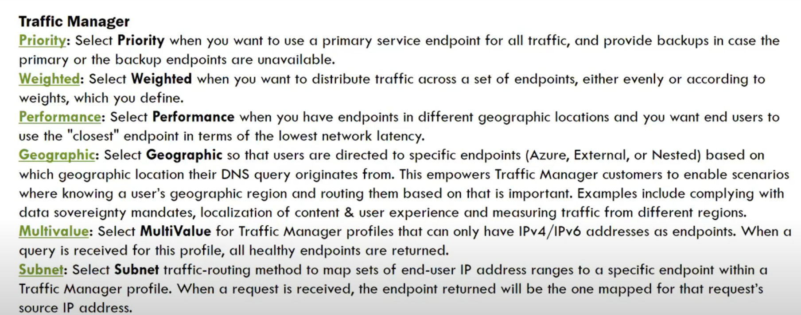

* DMZ -- Demilitarized zone

CIDR: Classless Inter-Domain Routing notation
192.168.0.0/24 => 192.168.0.0 to 192.168.0.255
192.168.0.0/16 => 192.168.0.0 to 192.168.255.255
192.168.0.0/08 => 192.168.0.0 to 192.168.0.255

Recommendation:
  Small network is start with 192.168.0.x
  Large Network: start with 

  IP -- Dynamic or static
Private Endpoints

* NSG can assoicate to either VM or Subnet.
* Routing tables will be attached to Subnets.
* VM backup's are stored in page blocks
* Azure VM's are backed by VHD's (virtual hard drive)
* Azure data box
* WAF (Web Application Firewall)

* Availability zone
* Virtual machine scale set
* Availability set (hardware level)
  - Fault Domains
  - Update Domains 

  * Webservers, database servers generally will have static ips
  * public dynamic ip, public static ip, private dynamic ip, private static ip

  * NSG can define either on subnet or VM
  * NIC (Network interface card) is the one who has IP address, not the VM
  * VM can have more than one NIC (that means, more than one IP)

  * Azure vm is created from free defined templates, and pre defined sizes. ( There is not much customization is available to create vm's, one should consider only from predefined templates.)

  * tracet yahoo.com
  * route print
  * UDR:User defined routes
  * Virtual appliances
  * Route Tables
      - Other VNETS
      - Virtual Network Gatesways
      - Virtual appliances
      - Others
  
### Next Hop type
  - Virtual Network
  - Virtual Network gateway
  - Vitual appliance
  - None
  - Internet

* Global VNET peering

* DNS commands
* nslookup
* ipconfig

### Accelerated Networking
**Without Accelerated Networking** all networking traffic in and out of the VM traverses the host and the virtual switch. The virtual switch provides all policy enforcement to network traffic. Policies include network security groups, access control lists, isolation, and other network virtualized services.

**With Accelerated Networking** network traffic that arrives at the VM's network interface (NIC) is forwarded directly to the VM. Accelerated Networking offloads all network policies that the virtual switch applied, and it applies them in hardware. Because hardware applies policies, the NIC can forward network traffic directly to the VM. The NIC bypasses the host and the virtual switch, while it maintains all the policies that it applied in the host.

### offloading network processing

### Proximity Placement Groups:
 A proximity placement group is a logical grouping used to make sure that Azure compute resources are physically located close to each other. Proximity placement groups are useful for workloads where low latency is a requirement.

### Terminology
 * Spinning
 * SKU Size
 * SSL off-loading
 * Offloading

### NAT Network address translation
* Public IP address: access through internet
* Private IP address: 

### PAT: Port address translation (Translation is nothing but forwarding)

  
### ASG (Application Service Group)

- **Purpose**: ASGs allow you to group Azure resources (typically virtual machines) based on their role or function in your application, making it easier to apply network security rules without needing to manage individual IP addresses.

- **Scope**: ASGs are used within NSG rules and apply at the **network interface (NIC)** level for specific virtual machines.
  
- **Components**:
  - **Logical Grouping**: ASGs provide a way to group VMs or resources into application-specific groups (e.g., `WebServers`, `AppServers`, `DBServers`), and then you can use these groups in your NSG rules to define access based on groups, not IPs.
  
- **Function**:
  - Instead of using IP addresses or specific NICs in your NSG rules, you use ASGs as the source or destination in NSG rules. This enables dynamic grouping of resources, simplifying management as resources scale up or down.
  - For example, if you have a web tier and a database tier, you can group VMs that belong to the web tier in an ASG called `WebServers`, and another ASG for the database tier called `DBServers`. Then, you can define NSG rules that allow traffic from `WebServers` to `DBServers` on specific ports.

- **Common Use Case**: ASGs are especially useful in complex environments with multiple tiers or microservices, where managing traffic between components is required, and the list of VMs or IP addresses may frequently change.
---
 ### **Network Security Group (NSG)**

- **Purpose**: An NSG is used to filter network traffic to and from Azure resources based on rules that define allowed or denied inbound and outbound traffic. It works at the network interface (NIC), subnet, or virtual machine (VM) level.
  
- **Scope**: NSGs can be associated with:
  - **Subnets**: To apply rules to all resources in a subnet.
  - **Network Interfaces**: To apply rules to specific resources, such as a VM's NIC.
  
- **Components**:
  - **Security Rules**: These are the inbound and outbound traffic filtering rules defined by:
    - **Source IP**: The IP address or range from where the traffic originates.
    - **Destination IP**: The IP address or range where the traffic is going.
    - **Port**: The port on which traffic is allowed or denied.
    - **Protocol**: The protocol (TCP, UDP, or Any) that the rule applies to.
  
- **Function**:
  - NSGs are used for setting rules based on IP addresses, subnets, ports, and protocols.
  - You can use **service tags** (e.g., `AzureCloud`, `Storage`) or **IP address ranges** in NSG rules to simplify managing access to Azure services.

- **Common Use Case**: NSGs are generally used to control traffic at the subnet or NIC level, providing an additional layer of security for Azure resources (e.g., VMs) by controlling which inbound and outbound traffic is allowed.

---
### Key Differences:

| Feature              | **Network Security Group (NSG)**                           | **Application Security Group (ASG)**                           |
|----------------------|------------------------------------------------------------|---------------------------------------------------------------|
| **Purpose**           | Filters inbound/outbound traffic based on IP addresses, ports, protocols, or service tags | Groups VMs or resources logically to simplify NSG rule management |
| **Scope**             | Applied at subnet, NIC, or VM level                        | Used inside NSG rules at the NIC level                         |
| **Traffic Management**| Uses IP addresses, service tags, or IP ranges in rules     | Uses logical groupings of resources in rules (grouped by ASGs) |
| **Use Case**          | Controlling traffic based on IPs, ports, and protocols     | Simplifying network rules for dynamic VM/application groups    |
| **Flexibility**       | Static in nature (IP addresses, ranges)                    | Dynamic and scalable (grouping resources based on role/function)|
| **Rule Definition**   | Source/Destination defined by IP address, range, or service tag | Source/Destination defined by ASG name     
---

---

### Example Scenario:

- **NSG**: You have an NSG rule allowing inbound traffic to a VM from the IP range `192.168.1.0/24` on port 80 (HTTP). The rule would allow traffic from any source in that IP range.

- **ASG with NSG**: You have a rule allowing inbound traffic from the ASG `WebServers` to the ASG `DBServers` on port 1433 (SQL). This means all VMs in the `WebServers` group can communicate with all VMs in the `DBServers` group over port 1433, without needing to specify individual IP addresses.

---

### Conclusion:
- **NSGs** are essential for controlling network traffic, but they rely on IP addresses or service tags.
- **ASGs** provide a more flexible and scalable way to manage traffic within NSG rules, grouping resources by function rather than by specific IPs, making it easier to manage security in dynamic environments.
---
### **Service Tags**
**Service Tags** in Azure are a simplified way to manage network security and allow or block traffic to Azure services. They represent a group of IP address prefixes for specific Azure services. Instead of manually managing IP addresses and ranges, you can use service tags in your **Network Security Groups (NSGs)**, **Azure Firewall**, or **User Defined Routes (UDRs)** to define network access controls for Azure resources.

### Key Points about Azure Service Tags:
1. **Simplifies Network Management**:
   - Service tags abstract the underlying IP addresses of services such as Azure Storage, Azure SQL Database, and Azure Key Vault. By using service tags, you don't have to worry about maintaining IP address lists.

2. **Auto-updated IP Ranges**:
   - The IP address ranges associated with service tags are automatically updated as Azure services expand and change, ensuring your rules remain up to date without manual intervention.

3. **Common Azure Service Tags**:
   - **AzureCloud**: Represents all Azure datacenters.
   - **Storage**: Covers all Azure Storage endpoints.
   - **KeyVault**: Represents Azure Key Vault.
   - **SQL**: Covers Azure SQL Database.
   - **AppService**: Covers Azure App Service endpoints.
   - **AzureActiveDirectory**: Represents Azure AD authentication endpoints.
   - **Internet**: Represents any traffic coming from the public internet.
   - **VirtualNetwork**: Represents traffic within the same virtual network.

4. **Use in Network Security Groups (NSGs)**:
   - You can use service tags in security rules in NSGs to control inbound and outbound traffic to Azure resources. This can be done by specifying a service tag in the source or destination field of an NSG rule.

5. **Use in Azure Firewall**:
   - Service tags can be used in firewall rules to allow or deny traffic to specific Azure services without the need to update IP address ranges manually.

6. **Examples**:
   - To allow traffic from Azure SQL Database to your virtual network, you can create a rule using the `Sql` service tag.
   - To block traffic to the internet while allowing communication with Azure services, you can create an NSG rule that denies traffic to the `Internet` service tag but allows traffic to specific Azure service tags like `Storage` or `KeyVault`.

### How to Use Service Tags in NSGs:
- **Example of an NSG Rule using Service Tags**:
   - **Allow Azure Storage Access**:
     - Source: VirtualNetwork
     - Destination: Service Tag `Storage`
     - Action: Allow
   - **Block Internet Access**:
     - Source: VirtualNetwork
     - Destination: Service Tag `Internet`
     - Action: Deny

### Advantages of Using Service Tags:
- **Ease of Management**: No need to manually update IP ranges for Azure services.
- **Automatic Updates**: Azure handles updates to the underlying IP addresses, ensuring continued connectivity.
- **Granularity**: You can allow or block traffic for specific services, enhancing network security and control.

In summary, **Azure Service Tags** simplify network security management by grouping the IP ranges of Azure services, allowing you to focus on services rather than managing individual IP addresses.

---
### Session Affinity
### Connection Draining
### WAF
### Traffic Manager
 * DNS based rougting
 * Geographical level load balancer
 * Distribute traffic for complex deployments
 * Policies: Traffic manager will use policy based routing
   - Priority
   - Weighted
   - Performance
   - Geographic
   - Multivalue
   - Subnet

   

   