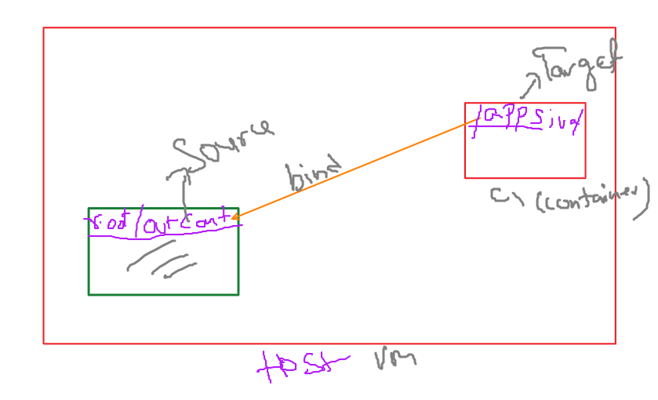

## Docker


[Network_volume](../images/5.pdf)

* Docker object
    - image
    - Containers
    - Networks
    - Volumes

* Cli

   - docker [docker object] [subcommand] [options] [arguments]

Eg:-
   - docker image ls
   - docker contianer ls

* important commands:
   - Connect (exec)
   - process
   - cp
   - logs
   - inspect/describe

   * in container world, we least bother about container IP, but **Host port** and **container port** is very important

> docker network ls
- bridge is default network in container

* one container in network1 can't communicate container in network2 by default.
* two containers in same network can be communicate each other.
* for Bridge (default) network, Container in same network will communicate only by IP address, they can not communicate using dns. bcz containers can't dns resolution by them self
* when we creates new network, then containers can communicate either using IP address or dns name.

* **ContainerPort**  when application is running inside the container and that application has a port is called container port

In Docker, the concepts of container port and host port are crucial for understanding how network communication is handled between the containerized applications and the outside world. Here’s a detailed explanation of the differences between container ports and host ports:

> There is difference between **P** and **p** in docker world
> When **p** is specified in docker command, it is expectig hostport and container port
> EG: docker run -d --name httpcont -p 81(hostport):80(containerport) httpd
> When **P** is stated, hostport is allocated randomly by system and container port is taken it from docker file.


### Container Port
- **Definition**: The container port is the port exposed by the application running inside the Docker container. This port is internal to the container and used by the containerized application to listen for incoming connections.
- **Usage**: It is specified in the Dockerfile using the `EXPOSE` instruction or at runtime when launching a container. The application inside the container binds to this port to receive traffic.
- **Example**:
  - In the Dockerfile: `EXPOSE 80`
  - In the Docker run command: `docker run -p 8080:80 myapp`
  - Here, `80` is the container port.

### Host Port
- **Definition**: The host port is the port on the host machine (the machine running the Docker container) that maps to the container port. This port allows external traffic to be directed to the appropriate port on the container.
- **Usage**: It is specified at runtime when starting the container. This mapping allows access to the application inside the container from the host machine or other external machines.
- **Example**:
  - In the Docker run command: `docker run -p 8080:80 myapp`
  - Here, `8080` is the host port.

### Key Differences
1. **Scope**:
   - **Container Port**: Internal to the container. It is only accessible from within the container or other containers on the same Docker network.
   - **Host Port**: External to the container. It is accessible from the host machine and potentially from other machines on the network.

2. **Configuration**:
   - **Container Port**: Defined in the Dockerfile using `EXPOSE` or dynamically at runtime.
   - **Host Port**: Defined at runtime using the `-p` or `--publish` flag.

3. **Accessibility**:
   - **Container Port**: Applications or services inside the container use this port to communicate with each other or to listen for incoming connections.
   - **Host Port**: Used by external clients or applications to communicate with the containerized application. 

### Examples

#### Mapping a Host Port to a Container Port
If you run a container with the following command:
```sh
docker run -p 8080:80 myapp
```
- The application inside the container listens on port `80` (container port).
- The Docker engine maps the host's port `8080` (host port) to the container's port `80`.
- Any traffic sent to the host on port `8080` is forwarded to the container's port `80`.

#### Multiple Containers with Different Host Ports
You can run multiple instances of the same containerized application by mapping different host ports to the same container port:
```sh
docker run -p 8080:80 myapp
docker run -p 8081:80 myapp
```
- Both containers listen on port `80` internally.
- The first container maps its port `80` to host port `8080`.
- The second container maps its port `80` to host port `8081`.

#### Exposing Ports in Dockerfile
You can specify the port your application listens to in the Dockerfile:
```Dockerfile
FROM nginx
EXPOSE 80
```
This tells Docker that the application will listen on port `80` inside the container. However, it doesn't map this port to a host port. The mapping still needs to be done at runtime:
```sh
docker run -p 8080:80 myapp
```

### Summary
- **Container Port**: The internal port on which the containerized application listens. It is specified in the Dockerfile or at runtime and is only accessible within the container or Docker network.
- **Host Port**: The external port on the host machine that maps to the container port. It allows access to the containerized application from outside the container.

Understanding these differences helps you effectively manage network communication in Dockerized environments, ensuring that applications are accessible where needed while maintaining proper isolation and security.


* In docker, there are 3 networks available by default
 - host (dangerous, )
 - bridge (default)
 - none

 ## Docker imp commands

 > docker run -dit --rm --name c1 ubuntu:custom

 * To Remove all containers forcefully
 > docker rm $(docker ps -aq) -f

 * To grep the IPAddress
 > docker container inspect <container_Name/ContainerID> | grep -i IPAddress

 * Below command  is used to start an interactive bash shell session inside a running docker container 
  > docker exec -it c1 /bin/bash
---
Notes:
Image format to push registry

docker inspect network <networkid>


to test the connection between 2 containers, use exec command to get inside of one container and ping the other one


docker exec -it c2 ping 172.17.0.2
kubectl exec -it podname processname

docker network create network1
docker network inespect network1

docker container run -dit --rm --name c4 --net network1 ubuntu:custom

docker network create sivanetwork --driver=bridge --subnet=192.168.10.0/24

docker network connect bridge c4

when connecting container to other network called n1, n1 will allocate some runtime ip to the container and it will allow to connect any container in that particular network.

### Host network
 - we never use host network in docker
 -- container will create directly on host. so that you cann't create any other container on that particular host as 80 (web) has already utilized.

----

### Volumes:

> contaienr data is **ephemerial** ( not persistent data)

* BInd mount (Docker) ---> Host path(k8s)
* Temp FS (Docker)   --- empty Dir (k8s)
* Docker Volumes (Docker)  -- Pv, pvc, sc (k8s)

* Bind Mount has two ways
  - mount flag
  - -v volume


* /var/lib/docker

* bind mount option
> docker container run -d --name bind-mount --mount type=bind,source=/root/outsidecont, target=/appsiva nginx

> docker exec -it <container_id> /bin/bash
> touch appsiva/23032024.log
-- delete the container
-- create the same container again
-- you can see the data now


* using bind mout option, source directoy must exist in the host machine

* -v volume option
>docker container run -d --name bind-volume -v /root/outsidecont2:/appsiva1 ngins


* using -v option option, source directoy will be create during the runtime if directory/folder is not exists
---
### docker commands

> docker images
> docker pull ubuntu

* To create the container
> docker run -d --name web01 nginx

> PS (it is similar to taskmanager in linux)
> docker ps (all docker container, only running containers)
> docker ps -a ( all running containers)
> docker insepct web01

* Container IP address can't access from outside the vm
* ifconfig (windows equals to ipconfig)[if: interface)]
   -- apt install net-tools  ( to work with if config, install net-tools in linux)
   -- **apt** is package manager in ubuntu

```docker
> docker run -dit --name web02  -p 8080:80 
# Mapping host port 8080 to container port 80
interanlly NAT (Network address translation) and PAT (Port address translation) happend
```

* Bridge (default)
* Host
* none  > docker run -d --name web05 --network none nginx
> docker netwrok ls

> docker run -d --name web03 --network host nginx
 - for the host network, there is no  dedicated container ip or port, host network will by default use host ip and port
 - Host network will be use only one port, so that multiple containers can't use same port
>docker logs web03

* Network non has no communication

* **netstat** command will return all the active ports on that system
* **netstart arn**
> docker network host inspect


docker exec -it container1 ping container2

* default bridge network does not have dns
> docker netwrok create my_bridge --driver bridge
> docker run -dit --name mybb01 --network my_bridge busybox
> docker run -dit --name mybb01 --network my_bridge nginx
* To support dns name, we must create custom bridge.
  - Eg: db server connection string will have hostname/dns name. to support dns, we need to create 
  * docker stop (docker ps -a -q)
  ---
  ### Docker commands
  ```docker
  # to show all running containers
    docker ps

# to show all  containers
    docker ps -a

# List docker object
   docker network ls
   docker volume ls
   docker image ls

# to see the details of docker images
   docker image inspect <image_name>
   docker network inspect <network_name>
   docker volume inspect <volume_name>
   docker container inspect <container_name>

 # to pull image

 #syntax
 docker pull <image_name>
 # example
 docker pull alpine

# To create the docker container, only container is created but not start
docker create --name web03 -p 8080:80 nginx 

# to start the container
docker start web03

# to stop the container
docker stop web03

# to remove docker container, docker will be removed only container is stopped state
docker rm web03

# Exec command
docker exec -it <container_name> /bin/bash

docker exec -it srv01 /bin/bash

# Starts a new process inside the container.
# Does not connect you to the main container process (such as the default entrypoint).
# Allows you to run specific commands inside a container without interrupting the main process.

# to commeout of the shell type exit

# attach 
docker attach srv01
docker attach <container_name>

# Connects to the main process inside the container.
# Any input/output from the process will be displayed in your terminal.
# If you detach from the container (with Ctrl + P + Q), the container continues running. However, if you exit the process, it will stop the container.

# to get ps and top command work, install procps
apt install procps
  ```

* To create a image in 2 ways
 - 1. image can be created from running container -- this is not preferred way to create image
 - 2. Image can be create from docker file

# to create image from running container, use docker commit command
 > docker commit srv01 custom_ubuntu
 > docker run -dit --name srv01 custom_ubuntu
 > docker exec -it srv01 /bin/bash

 # to watch docker history
 > docker history custom_ubuntu

 ---
 ### Environment Variables
 * Environment: eg: dev team, db team, test team, IT team..
 * Variable: it is place holder like cup, cup can have tea, coffe, juice, water, soup...Variable is holding variable data

 Types:
   * System Environment variables
   * user defined environment variables

> docker run -dit --name web01 -p 8000:80 -e VAR1=Admin123 nginx

* There are 3 ways of putting variables in container
- 1. set variables using docker run commands
- 2. take values from host environment variables
- 3. Configure variable through file (multiple values)

### Docker restart policy
no
on-failure
always  -- Error due to transactions inside the container, due to docker platform issues and if manually stopped
unless-stopped: it won't start manually stopped container


### Docker Compose for multi container application
> docker-compose up -d

> docker-compose down 

> docker-compose ps
> docker-comose ps --services
> docker-compose images
> docker-compose stop
> docker-compose start
> docker-compose run vote
> docker-compose build
> docker logs 
