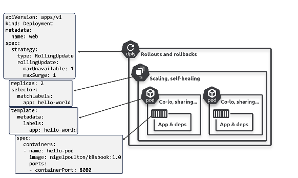

# Service:

* By default pod will have IP address and Container will have port number
* A pod can host multiple containers, each requiring a unique port number.
* if pod dies by any reason, when new pod genereated, newly genereated pod may have different ip address
* Pod is typically **process**, where as service is an **entry point** (Service is like security guard at typical building and Pod is individual apartments/neibhors).
* svc > route the  traffic to pods
>        - svc maintains list of pods information across nodes
>        - svc will have static ip
>        - svc will use matching labels to send the traffic
>        - svc will be a entry point (Example: Apartment Security and residents, residents will be - registereing at security desk.)
>       - svc maintains registry, when new pod generated, pod will be registered in SVC registery.  

Service: 3 types of redirections
 1) ClusterIP (internal to cluster)
 2) NodePort (testing node port): accessing certain applicaiton on particular node using node port 
                NodeIP
                Pod IP
                Container Port (also called target port, docker generally called container port)
                Service will have ip and port, (usually service port is called as Port only)
 3) Load Balancer (Useful in managed clusters)

* in svc, 3 things are important..they are (port, node port, target port)
* while creatin service, if you don't mention the port, bydefault, kubernetes will take target port as service port
*  Service would spance across multiple nodes, in this scenario, service will open node port in all available nodes
*  in vpn, service will 
*  pod, deployment, Service would bound to namespace
* Each micro service will have one service

* Docker:- Container Port: host port

```
apiVersion: v1
kind: Service
metadata:
    name: svc-color
spec:
    Selector: 
        color: gree # For which pod I should route the traffic
    type: NodePort
    ports: 80 # service port, it is optional, if it is not specified, target port will be the svc port by default.
    protocol: TCP
    targetPort: 8080 # my container port

```

```
kubectl apply -f svc.yaml
```
* 
```
kubectl describe svc svc-color

kubectl get ep svc-color # ep: endpoint
```

*** When to use Node port: ***
* Nodeport is useful if application is in early stage to test the routig, otherwise nodeport is never used in realtime
* In Nodeport scenario, shareing node IP with customer is not correct approach and not suggistable. What if Node is changed eventually?

ClusterIP: Expose the Pod with in the cluster only


```
kubectl expose deploy nginx --target-port 80 --port 80 --type LoadBalancer
```

* How Ip's would create for each type of service:
> Cluster Ip -> SVC -> ClusterIP

> NodePort   -> svc  -> ClusterIP + NodePort

> Load Balancer -> svc -> ClusterIP + NodePort + Loadbalancer IP

---

# Deployments:
### What is the Difference Between ReplicaSet and Deployment in Kubernetes?

**ReplicaSet** and **Deployment** are both used in Kubernetes to manage the availability of application pods. However, they serve different purposes and have different levels of functionality.

**ReplicaSet:**

- **Purpose:** Ensures a specified number of pod replicas are running at any given time.
- **Usage:** Used to maintain the desired state of pod replicas.
- **Features:**
  - Manages the number of replicas of a pod.
  - Ensures that if a pod crashes or is deleted, a new one is created to maintain the desired number of replicas.
- **Limitations:**
  - Does not provide rolling updates, rollback capabilities, or other deployment management features.

**Deployment:**

- **Purpose:** Provides declarative updates for pods and ReplicaSets.
- **Usage:** Used to manage stateless applications and ensures that updates to applications are rolled out smoothly and reliably.
- **Features:**
  - Manages ReplicaSets and can update them declaratively.
  - Supports rolling updates, rollbacks, and versioning of application deployments.
  - Allows for easy updates and scaling of applications.
  - Provides a higher-level abstraction for managing applications.
- **Advantages:**
  - Automates the process of updating applications, ensuring zero downtime and easy rollback if something goes wrong.
  - Simplifies the process of managing multiple versions of an application.
  - Enhances deployment strategies with features like canary deployments and blue-green deployments.

### What is the Need for Deployment?

- **Declarative Updates:** Allows you to declare the desired state of your application, and Kubernetes ensures this state is achieved and maintained.
- **Rolling Updates:** Facilitates smooth updates to applications without downtime by incrementally updating pods with the new version.
- **Rollback:** Provides the ability to rollback to previous versions if the new deployment causes issues.
- **Scaling:** Simplifies the process of scaling applications up or down based on demand.
- **Consistency:** Ensures that all replicas of an application are running the same version, maintaining consistency across the cluster.

### Disadvantages of Using Only ReplicaSet

- **Lack of Update Management:** ReplicaSets do not support rolling updates or rollbacks, making it harder to manage application updates without downtime.
- **Manual Intervention:** Updates and rollbacks have to be managed manually, which can lead to increased operational complexity and potential for errors.
- **No Declarative Management:** ReplicaSets do not provide the declarative approach to application management, requiring more manual effort to maintain the desired state of the application.

In summary, while ReplicaSets are useful for maintaining a stable set of pod replicas, Deployments provide a higher level of abstraction and automation, making them essential for managing updates, rollbacks, and scaling of applications in a Kubernetes environment.

```
apiVersion: apps/v1
kind: Deployment
metadata:
    name: python-app
spec:
    template:
        metadata:
            name: mypod
            labels:
                app: python
        spec:
            containers:
            -   image: devopswithcloudhub/python_webpage:greencont
                name: greencont
    replicas: 2
    selector:
        matchLabels:
            app: python-app
```

> kubectl describe deploy python-app | grep -i image

* Eventually eployment will maintain multiple replicasets to make rollback feature possible

* Rollout
* rolling
* Recreate

* Deployment strategies:
- Rolling update strategy (Default) : MaxSurge and maxUnavailable
  Rollback strategy
  Recreate Strategy


- to get the yaml file for the deployment
  > kubectl get deploy <Deployment_Name> -o yaml

  ```
    apiVersion: apps/v1
    kind: Deployment
    metadata:
        name: Rol-deploy
    spec:
        template:
            metadata:
                labels:
                type: rol
            spec:
                containers:
                -   image: devopswithcloudhub/python_webpage:greencont
                    name: python
        replicas: 6
        selector:
            matchLabels:
                type: rol
        strategy:
            type: RollingUpdate
            rollingUpdate:
                maxSurge: 50%
                maxUnavailable: 25%
    
  ```

  > When we use Recreate strategy?
    During the devlopment is ok to recreate 

# Scale Commad
    * Scale command will usefully ot increase or decrese the number of pods in the deploy
 > kubectl scale deploy rol-deploy --replicas 4

# Set Image
* to set the different image to the deployemnt
 > kubect set image deployment/rol-deploy pythong=devopswithcloudhub/python_webpage:red
 * use case:
    in Ci/Cd pipelines, when new build is created with git commit id, and when image is need to set during runtime. usually tag name will change deployment to deployment or 


