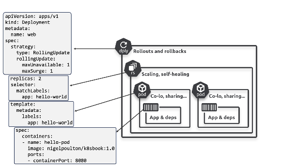

# Service:

* By default pod will have IP address and Container will have port number
* A pod can host multiple containers, each requiring a unique port number.
* if pod dies by any reason, when new pod genereated, newly genereated pod may have different ip address
* Pod is typically ***process***, where as service is an **entry point** (Service is like security guard at typical building and Pod is individual apartments/neibhors).
* svc > route the  traffic to pods
>        - svc maintains list of pods information across nodes
>        - svc will have *static ip*
>        - svc will use matching labels to send the traffic
>        - svc will be a entry point (Example: Apartment Security and residents, residents will be - registereing at security desk.)
>       - svc maintains registry, when new pod generated, pod will be registered in SVC registery.  

Service: 3 types of redirections
 1) ClusterIP (internal to cluster)
 2) NodePort (testing node port): accessing certain applicaiton on particular node using node port 
                NodeIP
                Pod IP
                Container Port (also called **target port**, docker generally called **container port**)
                Service will have ip and port, (usually service port is called as **Port** only)
 3) Load Balancer (Useful in managed clusters)

* in svc, 3 things are important..they are (port, node port, target port)
* while creatin service, if you don't mention the port, bydefault, kubernetes will take target port as service port
*  Service would span across multiple nodes, in this scenario, service will open node port in all available nodes
*  in vpn, service will 
*  Pod, deployment, Service would bound to namespace
* Each micro service will have one service

* Docker:- Container Port: host port

```
apiVersion: v1
kind: Service
metadata:
    name: svc-color
spec:
    Selector: 
        color: green # For which pod I should route the traffic
    type: NodePort
    ports: 80 # service port, it is optional, if it is not specified, target port will be the svc port by default.
    protocol: TCP
    targetPort: 8080 # my container port

```

```
kubectl apply -f svc.yaml
```

```
kubectl describe svc svc-color

kubectl get ep svc-color # ep: endpoint
```

*** When to use Node port: ***
* Nodeport is useful if application is in early stage to test the routig to each node, otherwise nodeport is never used in realtime
* In Nodeport scenario, sharing node IP with customer is not correct approach and not suggistable. What if Node is changed eventually?

ClusterIP: Expose the Pod with in the *cluster* only

* Imperative command to create deployment
```
kubectl expose deploy nginx --target-port 80 --port 80 --type LoadBalancer
```

* How Ip's would create for each type of service:
> Cluster Ip -> SVC -> ClusterIP

> NodePort   -> svc  -> ClusterIP + NodePort

> Load Balancer -> svc -> ClusterIP + NodePort + Loadbalancer IP

---


# Deployments:
### What is the Difference Between ReplicaSet and Deployment in Kubernetes?

**ReplicaSet** and **Deployment** are both used in Kubernetes to manage the availability of application pods. However, they serve different purposes and have different levels of functionality.

**ReplicaSet:**

- **Purpose:** Ensures a specified number of pod replicas are running at any given time.
- **Usage:** Used to maintain the desired state of pod replicas.
- **Features:**
  - Manages the number of replicas of a pod.
  - Ensures that if a pod crashes or is deleted, a new one is created to maintain the desired number of replicas.
- **Limitations:**
  - Does not provide rolling updates, rollback capabilities, or other deployment management features.

**Deployment:**

- **Purpose:** Provides declarative updates for pods and ReplicaSets.
- **Usage:** Used to manage stateless applications and ensures that updates to applications are rolled out smoothly and reliably.
- **Features:**
  - Manages ReplicaSets and can update them declaratively.
  - Supports rolling updates, rollbacks, and versioning of application deployments.
  - Allows for easy updates and scaling of applications.
  - Provides a higher-level abstraction for managing applications.
- **Advantages:**
  - Automates the process of updating applications, ensuring zero downtime and easy rollback if something goes wrong.
  - Simplifies the process of managing multiple versions of an application.
  - Enhances deployment strategies with features like canary deployments and blue-green deployments.
## Deployment Commands
**Create Deployment**

* Create a Deployment using a YAML file:
```
kubectl apply -f deployment.yaml
```
* Create a Deployment using a command:

```
kubectl create deployment my-deployment --image=my-image:tag
```

** Get Deployment Information
* Get all Deployments:
```
kubectl get deployments
```
* Get detailed information about a specific Deployment:

```
kubectl get deployment my-deployment -o yaml
```

* Describe a specific Deployment:

```
kubectl describe deployment my-deployment
```
**Update a Deployment**
* Update a Deployment using a YAML file:

```
kubectl apply -f deployment.yaml
```
* Set a new image for a Deployment:
```
kubectl set image deployment/my-deployment my-container=my-image:tag
```
* Scale a Deployment 
```
kubectl scale deployment my-deployment --replicas=3
```
**Rolling Update and Rollback**

* Perform a rolling update:
```
kubectl rollout restart deployment/my-deployment
```
* Get the rollout status:
```
kubectl rollout status deployment/my-deployment
```
* Pause a rolling update:

```
kubectl rollout pause deployment/my-deployment
```
* Resume a paused rolling update:
```
kubectl rollout resume deployment/my-deployment
```
* Rollback to a previous revision:
```
kubectl rollout undo deployment/my-deployment
```

* Rollback to a specific revision:
```
kubectl rollout undo deployment/my-deployment --to-revision=2
```
**Delete a Deployment**
* Delete a Deployment
```
kubectl delete deployment my-deployment
```
**View Deployment History**
* View rollout history:
```
kubectl rollout history deployment/my-deployment
```
* View details of specific revision
```
kubectl rollout history deployment/my-deployment --revision=2
```
**Other Useful Commands**
* Explain a Deployment resource (provides documentation):

```
kubectl explain deployment
```
* Get events related to a Deployment:
```
kubectl get events --field-selector involvedObject.kind=Deployment,involvedObject.name=my-deployment
```
* Label a Deployment:
```
kubectl label deployment my-deployment new-label=new-value
```


### What is the Need for Deployment?


- **Declarative Updates:** Allows you to declare the desired state of your application, and Kubernetes ensures this state is achieved and maintained.
- **Rolling Updates:** Facilitates smooth updates to applications without downtime by incrementally updating pods with the new version.
- **Rollback:** Provides the ability to rollback to previous versions if the new deployment causes issues.
- **Scaling:** Simplifies the process of scaling applications up or down based on demand.
- **Consistency:** Ensures that all replicas of an application are running the same version, maintaining consistency across the cluster.

### Disadvantages of Using Only ReplicaSet

- **Lack of Update Management:** ReplicaSets do not support rolling updates or rollbacks, making it harder to manage application updates without downtime.
- **Manual Intervention:** Updates and rollbacks have to be managed manually, which can lead to increased operational complexity and potential for errors.
- **No Declarative Management:** ReplicaSets do not provide the declarative approach to application management, requiring more manual effort to maintain the desired state of the application.

In summary, while ReplicaSets are useful for maintaining a stable set of pod replicas, Deployments provide a higher level of abstraction and automation, making them essential for managing updates, rollbacks, and scaling of applications in a Kubernetes environment.

```
apiVersion: apps/v1
kind: Deployment
metadata:
    name: python-app
spec:
    template:
        metadata:
            name: mypod
            labels:
                app: python
        spec:
            containers:
            -   image: devopswithcloudhub/python_webpage:greencont
                name: greencont
    replicas: 2
    selector:
        matchLabels:
            app: python-app
```

> kubectl describe deploy python-app | grep -i image

* Eventually eployment will maintain multiple replicasets to make rollback feature possible

* Rollout
* rolling
* Recreate

* Deployment strategies:
- Rolling update strategy (Default) : MaxSurge and maxUnavailable
  Rollback strategy
  Recreate Strategy


- to get the yaml file for the deployment
  > kubectl get deploy <Deployment_Name> -o yaml

  ```
    apiVersion: apps/v1
    kind: Deployment
    metadata:
        name: Rol-deploy
    spec:
        template:
            metadata:
                labels:
                type: rol
            spec:
                containers:
                -   image: devopswithcloudhub/python_webpage:greencont
                    name: python
        replicas: 6
        selector:
            matchLabels:
                type: rol
        strategy:
            type: RollingUpdate
            rollingUpdate:
                maxSurge: 50%
                maxUnavailable: 25%
    
  ```

  > When we use Recreate strategy?
    During the devlopment is ok to recreate 

# Scale Commad
    * Scale command will usefully ot increase or decrese the number of pods in the deploy
 > kubectl scale deploy rol-deploy --replicas 4

# Set Image
* to set the different image to the deployemnt
 > kubect set image deployment/rol-deploy pythong=devopswithcloudhub/python_webpage:red
 * use case:
    in Ci/Cd pipelines, when new build is created with git commit id, and when image is need to set during runtime. usually tag name will change deployment to deployment or 

The `kubectl set image` command is a powerful tool in Kubernetes for updating the container image of a pod, deployment, daemonset, or other resources. This command allows you to change the image used by a specific container in one or more pods without downtime, facilitating rolling updates.

### Basic Syntax

```sh
kubectl set image [RESOURCE_TYPE/RESOURCE_NAME] [CONTAINER_NAME=IMAGE]
```

### Use Cases

1. **Updating a Deployment to a New Image Version**
   - **Scenario**: You have a deployment named `myapp-deployment` and want to update the container image `myapp` to a new version `v2.0`.
   - **Command**:
     ```sh
     kubectl set image deployment/myapp-deployment myapp=myapp:v2.0
     ```

2. **Rolling Back to a Previous Image Version**
   - **Scenario**: After updating to a new version, you find a critical bug and need to roll back to the previous version `v1.0`.
   - **Command**:
     ```sh
     kubectl set image deployment/myapp-deployment myapp=myapp:v1.0
     ```

3. **Updating Images for Multiple Containers in a Single Deployment**
   - **Scenario**: Your deployment `myapp-deployment` has multiple containers, `frontend` and `backend`, and you want to update both images.
   - **Command**:
     ```sh
     kubectl set image deployment/myapp-deployment frontend=frontend:v2.0 backend=backend:v2.0
     ```

4. **Updating a DaemonSet**
   - **Scenario**: You have a DaemonSet named `log-collector` that runs a logging agent on all nodes, and you need to update the image to `log-agent:v2.0`.
   - **Command**:
     ```sh
     kubectl set image daemonset/log-collector log-agent=log-agent:v2.0
     ```

5. **Updating a StatefulSet**
   - **Scenario**: You have a StatefulSet named `db-statefulset` and want to update the container image `db-container` to `db-image:v2.0`.
   - **Command**:
     ```sh
     kubectl set image statefulset/db-statefulset db-container=db-image:v2.0
     ```

6. **Updating a Job**
   - **Scenario**: You have a Job named `backup-job` and need to update the image to `backup-tool:v2.0`.
   - **Command**:
     ```sh
     kubectl set image job/backup-job backup-container=backup-tool:v2.0
     ```

7. **Updating Images for All Deployments in a Namespace**
   - **Scenario**: You want to update the image of all deployments in the `default` namespace to `myapp:v2.0`.
   - **Command**:
     ```sh
     kubectl set image deployments --all myapp=myapp:v2.0
     ```

8. **Updating Image with Specific Label Selector**
   - **Scenario**: You want to update the image of all deployments with the label `app=myapp` to `myapp:v2.0`.
   - **Command**:
     ```sh
     kubectl set image deployments -l app=myapp myapp=myapp:v2.0
     ```

### Real-Time Use Cases

1. **Continuous Integration/Continuous Deployment (CI/CD) Pipelines**
   - **Scenario**: As part of your CI/CD pipeline, you want to automatically deploy the latest build of your application to a Kubernetes cluster.
   - **Implementation**:
     ```sh
     kubectl set image deployment/myapp-deployment myapp=myapp:$CI_BUILD_TAG
     ```

2. **Canary Releases**
   - **Scenario**: You want to perform a canary release by updating a subset of your pods to a new version before a full rollout.
   - **Implementation**: This might involve creating a separate canary deployment with the new image and gradually shifting traffic to it.

3. **Blue-Green Deployments**
   - **Scenario**: You want to implement a blue-green deployment strategy by updating a separate deployment with the new image, testing it, and then switching over.
   - **Implementation**: This typically involves creating a new deployment with the new image and using a service or ingress to switch traffic.

4. **Emergency Patches**
   - **Scenario**: You need to quickly patch a critical vulnerability in your application by updating the image to a new version with the fix.
   - **Implementation**:
     ```sh
     kubectl set image deployment/myapp-deployment myapp=myapp:v2.1
     ```

5. **Scaling Up with Updated Images**
   - **Scenario**: You need to scale up your application with updated container images as part of a scaling strategy.
   - **Implementation**:
     ```sh
     kubectl scale deployment/myapp-deployment --replicas=10
     kubectl set image deployment/myapp-deployment myapp=myapp:v2.0
     ```

Using `kubectl set image` allows for seamless and flexible updates to your container images, ensuring minimal downtime and facilitating various deployment strategies in Kubernetes.



[deployment documentation](https://kubernetes.io/docs/concepts/workloads/controllers/deployment/)


> kubectl rollout

> kubectl rollout history <deployment_name>

Available Commands:

* history
* pause
* restart
* resume
* status 
* undo

* there is no specific command to rollback, it is 
> kubectl rollout undo <deployment_name> --to-revision=<revision_number>